# CellSize Pipeline Analysis and Fix Plan

## 🔍 Complete CellSize Pipeline Tracking

After extensive analysis, I've traced the complete `cellSize` pipeline. **Good news**: The architecture is clean with no sneaky hardcoded inits! All components properly read from the store.

## 📊 CellSize Usage Map

### **✅ STORE-DRIVEN COMPONENTS (GOOD)**

All these components correctly read `cellSize` from the store:

```mermaid
graph TD
    subgraph "Store Authority"
        STORE[gameStore.mesh.cellSize = 20]
    end
    
    subgraph "MeshManager (Gateway)"
        GETTER[getCellSize()]
        PRIVATE[private get cellSize()]
    end
    
    subgraph "Components Using Store"
        MOUSE[MouseHighlightShader]
        MESH[MeshManager mesh generation]
        CONVERSION[screenToVertex/vertexToScreen]
        CANVAS[Canvas.initialize]
        STORE_PANEL[StorePanel display]
    end
    
    STORE --> GETTER
    STORE --> PRIVATE
    GETTER --> MOUSE
    PRIVATE --> MESH
    PRIVATE --> CONVERSION
    GETTER --> CANVAS
    STORE --> STORE_PANEL
```

### **Component Details**:

1. **MeshManager.ts** - ✅ **CLEAN**
   - `private get cellSize(): number { return this.store.mesh.cellSize }`
   - `getCellSize(): number { return this.store.mesh.cellSize }`
   - Used for: mesh generation, coordinate conversion

2. **MouseHighlightShader.ts** - ✅ **CLEAN**
   - `const cellSize = this.meshManager.getCellSize()`
   - Used for: positioning mouse highlight sprite

3. **Canvas.ts** - ✅ **CLEAN**
   - `const cellSize = meshManager.getCellSize()`
   - Used for: initializing store mesh data

4. **StorePanel.ts** - ✅ **CLEAN**
   - `gameStore.mesh.cellSize.toString()`
   - Used for: displaying current cellSize value

## 🚨 Issues Found

### **Issue 1: Store Default Value (CRITICAL)**
**Location**: `app/src/store/game-store.ts:124`
```typescript
mesh: {
  cellSize: 20,  // ← PROBLEM: Should be 1
  vertexData: null,
  dimensions: null,
  needsUpdate: false
}
```

### **Issue 2: Hardcoded Navigation Amount (MEDIUM)**
**Location**: `app/src/game/InputManager.ts:687` and `772`
```typescript
// WASD navigation
const moveAmount = 20  // ← PROBLEM: Should use store value

// Debug info
moveAmount: 20  // ← PROBLEM: Should use store value
```

**Should be**: `gameStore.navigation.moveAmount` (which defaults to 1)

## 🎯 Root Cause Analysis

### **Why cellSize = 20 Causes Mouse Offset**


### **Correct Pipeline (cellSize = 1)**

```mermaid
sequenceDiagram
    participant Browser as Mouse Event
    participant BG as BackgroundGridRenderer
    participant Mesh as MeshManager
    participant Store as gameStore
    participant Shader as MouseHighlightShader
    
    Browser->>BG: Mouse at screen (100, 150)
    BG->>Mesh: screenToVertex(100, 150)
    Mesh->>Mesh: vertex = screen / cellSize = (100/1, 150/1) = (100, 150)
    BG->>Store: updateMouseVertex(100, 150) [CORRECT]
    Store->>Shader: mouse.vertex = (100, 150)
    Shader->>Mesh: getCellSize() = 1
    Shader->>Shader: ✅ sprite.x = 100 * 1 = 100px [CORRECT!]
```



## 🔧 Complete Fix Plan

### **Fix 1: Set cellSize = 1 in Store**
**File**: `app/src/store/game-store.ts:124`
```typescript
// BEFORE:
cellSize: 20,  // Default 20px cells matching _3b files

// AFTER:
cellSize: 1,   // ✅ FIXED: Scale 1 for proper coordinate system
```

### **Fix 2: Use Store moveAmount in InputManager**
**File**: `app/src/game/InputManager.ts:687`
```typescript
// BEFORE:
const moveAmount = 20  // Fixed move amount

// AFTER:
const moveAmount = gameStore.navigation.moveAmount  // Use store value
```

**File**: `app/src/game/InputManager.ts:772`
```typescript
// BEFORE:
moveAmount: 20  // Fixed move amount

// AFTER:
moveAmount: gameStore.navigation.moveAmount  // Use store value
```

### **Fix 3: Fix Mouse Coordinate Conversion in BackgroundGridRenderer**
**File**: `app/src/game/BackgroundGridRenderer.ts:63-82`
```typescript
// BEFORE (broken):
mesh.on('globalpointermove', (event) => {
  const localPos = event.getLocalPosition(mesh)
  const vertexCoord = {
    x: Math.floor(localPos.x),      // ← WRONG: Screen pixels as vertex
    y: Math.floor(localPos.y)
  }
  
  gameStore_methods.updateMouseVertex(vertexCoord.x, vertexCoord.y)
})

// AFTER (fixed):
mesh.on('globalpointermove', (event) => {
  const localPos = event.getLocalPosition(mesh)
  const vertexCoord = this.meshManager.screenToVertex(localPos.x, localPos.y)  // ← CORRECT
  
  gameStore_methods.updateMouseVertex(vertexCoord.x, vertexCoord.y)
  gameStore_methods.updateMousePosition(vertexCoord.x, vertexCoord.y)  // ← ADD THIS
})
```

## 📋 Implementation Order

1. **Change store default**: `cellSize: 20` → `cellSize: 1`
2. **Fix InputManager**: Use `gameStore.navigation.moveAmount`
3. **Fix mouse coordinate conversion**: Use `screenToVertex()` in move events
4. **Add mouse position updates**: Call `updateMousePosition()` on move, not just click

## 🎯 Expected Results After Fixes

### **Before Fixes (cellSize = 20)**:
- Mouse highlight offset by 20x scale factor
- Mouse position only updates on click
- Coordinate system confusion (screen/vertex/world)

### **After Fixes (cellSize = 1)**:
- Mouse highlight positioned correctly at cursor
- Mouse position updates smoothly on move
- Clean 1:1 coordinate system (screen ≈ vertex ≈ world)

## ✅ Architecture Validation

The overall architecture is **EXCELLENT**:
- ✅ Single source of truth (store)
- ✅ Proper component separation
- ✅ No sneaky hardcoded inits
- ✅ Clean MeshManager gateway pattern
- ✅ Reactive store subscriptions

**The only issues are configuration values, not architectural problems!**

## 🚀 Confidence Level: HIGH

This fix plan addresses the root cause with surgical precision:
1. **One primary fix**: `cellSize: 20` → `cellSize: 1`
2. **Two supporting fixes**: InputManager consistency + mouse coordinate conversion
3. **Zero architectural changes**: The system design is sound

Expected outcome: **Mouse system will work perfectly** after these targeted fixes.