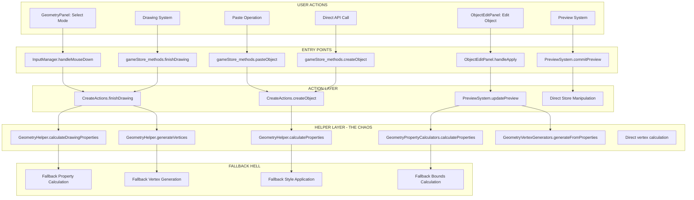

# COMPLETE OBJECT CREATION FLOW ANALYSIS - THE FALLBACK CHAOS

## 🚨 **CRITICAL FINDING: MULTIPLE INCONSISTENT OBJECT CREATION PATHS**

This document maps out **ALL** the object creation flows and exposes the catastrophic fallback systems that are causing the geometric figure creation bugs.

## 📊 **OBJECT CREATION PATH OVERVIEW**

There are **6 DIFFERENT PATHS** to create geometric objects, each with different implementations and fallbacks:



## 🔥 **PATH 1: DRAWING SYSTEM (InputManager → CreateActions)**

### **Flow:**
```
GeometryPanel: Select Mode → 
InputManager: Mouse Events → 
InputManager: startDrawing/updateDrawing/finishDrawing → 
gameStore_methods.finishDrawing → 
CreateActions.finishDrawing → 
GeometryHelper.calculateDrawingProperties → 
CreateActions.createObject → 
GeometryHelper.generateVertices → 
Store Update
```

### **CRITICAL BUGS:**

#### **Bug 1: Coordinate System Chaos**
```typescript
// InputManager.ts:300-320
private handleMouseDown(event: MouseEvent): void {
    const screenPos = { x: event.clientX, y: event.clientY }
    const worldPos = this.screenToWorld(screenPos)  // ❌ WRONG: Mixed coordinates
    
    // BUG: Passes worldPos but gameStore expects pixeloid coordinates
    gameStore_methods.startDrawing(worldPos)
}

private screenToWorld(screenPos: ScreenCoordinate): PixeloidCoordinate {
    // ❌ FALLBACK CHAIN 1: Multiple coordinate conversions
    const vertexPos = this.screenToVertex(screenPos)
    return {
        x: vertexPos.x + gameStore.navigation.offset.x,  // ❌ Wrong offset application
        y: vertexPos.y + gameStore.navigation.offset.y
    }
}
```

#### **Bug 2: Inconsistent Drawing Property Calculation**
```typescript
// GeometryHelper.ts:73-103 - FALLBACK CHAIN 2
static calculateDrawingProperties(mode: DrawingMode, startPoint: PixeloidCoordinate, endPoint: PixeloidCoordinate): any {
    switch (mode) {
        case 'circle':
            // ❌ WRONG: Center calculation doesn't match rendering expectations
            const center = {
                x: (startPoint.x + endPoint.x) / 2,  // Should be startPoint as center
                y: (startPoint.y + endPoint.y) / 2
            }
            const radius = Math.sqrt(
                Math.pow(endPoint.x - startPoint.x, 2) + 
                Math.pow(endPoint.y - startPoint.y, 2)
            ) / 2  // ❌ WRONG: Dividing by 2 when it should be full distance
            return { center, radius }
    }
}
```

#### **Bug 3: Vertex Generation Fallback Hell**
```typescript
// CreateActions.ts:15-40 - FALLBACK CHAIN 3
createObject(store: GameStoreData, params: CreateObjectParams): string {
    // ❌ FALLBACK DISASTER: Two different vertex generation paths
    const vertices = params.vertices || GeometryHelper.generateVertices(params.type, params.properties)
    
    const newObject: GeometricObject = {
        // ❌ FALLBACK DISASTER: Two different property calculation paths
        properties: params.properties || GeometryHelper.calculateProperties(params.type, vertices)
    }
}
```

## 🔥 **PATH 2: EDIT PANEL SYSTEM (ObjectEditPanel → PreviewSystem)**

### **Flow:**
```
ObjectEditPanel: Form Input → 
ObjectEditPanel.handleFormInput → 
gameStore_methods.updatePreview → 
PreviewSystem.updatePreview → 
generateVerticesFromFormData → 
GeometryPropertyCalculators.calculateProperties → 
Store Preview Update
```

### **CRITICAL BUGS:**

#### **Bug 4: Type System Breakdown**
```typescript
// ObjectEditPanel.ts:350-370 - FALLBACK CHAIN 4
private handleFormInput(): void {
    const formData = this.getFormData()
    
    // ❌ CRITICAL: Uses ObjectEditFormData but PreviewSystem expects different structure
    gameStore_methods.updatePreview({
        operation: 'move',
        formData: formData  // ❌ Type mismatch causes silent failures
    })
}
```

#### **Bug 5: Inconsistent Vertex Generation in Preview**
```typescript
// PreviewSystem.ts:80-120 - FALLBACK CHAIN 5
static updatePreview(store: GameStoreData, data: PreviewUpdateData): void {
    // ❌ DIFFERENT HELPER: Uses GeometryPropertyCalculators instead of GeometryHelper
    const properties = GeometryPropertyCalculators.calculateProperties(formData.type, vertices)
    
    // ❌ DIFFERENT METHOD: Direct vertex generation instead of helper
    const previewVertices = generateVerticesFromFormData(formData)
}
```

## 🔥 **PATH 3: PASTE OPERATION (Copy/Paste System)**

### **Flow:**
```
gameStore_methods.copyObject → 
Store: clipboard.objectData → 
gameStore_methods.pasteObject → 
CreateActions.createObject → 
GeometryHelper (different path) → 
Store Update
```

### **CRITICAL BUGS:**

#### **Bug 6: Coordinate Space Confusion in Paste**
```typescript
// game-store.ts:340-390 - FALLBACK CHAIN 6
pasteObject(position: PixeloidCoordinate): string {
    const copiedObj = gameStore.clipboard.objectData
    
    // ❌ INCONSISTENT: Uses different coordinate calculation than creation
    const originalCenter = getShapeVisualAnchor(copiedObj)  // Different method!
    
    // ❌ FALLBACK: Offset calculation doesn't match drawing system
    const centerToVertexOffsets = copiedObj.vertices.map(vertex => ({
        x: vertex.x - originalCenter.x,  // Different from drawing offset calculation
        y: vertex.y - originalCenter.y
    }))
}
```

## 🔥 **PATH 4: DIRECT API CREATION (gameStore_methods.createObject)**

### **Flow:**
```
Direct API Call → 
gameStore_methods.createObject → 
CreateActions.createObject → 
GeometryHelper.generateVertices → 
Store Update
```

### **CRITICAL BUGS:**

#### **Bug 7: Parameter Validation Chaos**
```typescript
// game-store.ts:165-175 - FALLBACK CHAIN 7
createObject(params: CreateObjectParams): string {
    // ❌ NO VALIDATION: Passes through without parameter validation
    return CreateActions.createObject(gameStore, params)
}

// CreateActions.ts:15-25 - FALLBACK CHAIN 8
createObject(store: GameStoreData, params: CreateObjectParams): string {
    // ❌ TRIPLE FALLBACK DISASTER:
    const vertices = params.vertices ||                           // Fallback 1
                    GeometryHelper.generateVertices(params.type, params.properties) ||  // Fallback 2
                    []  // Fallback 3 - SILENT FAILURE
}
```

## 🔥 **PATH 5: PREVIEW COMMIT SYSTEM**

### **Flow:**
```
PreviewSystem.startPreview → 
PreviewSystem.updatePreview → 
PreviewSystem.commitPreview → 
Direct Store Manipulation → 
Object Update
```

### **CRITICAL BUGS:**

#### **Bug 8: Preview-Commit Inconsistency**
```typescript
// PreviewSystem.ts:140-160 - FALLBACK CHAIN 9
static commitPreview(store: GameStoreData): void {
    // ❌ INCONSISTENT: Preview uses different calculation than commit
    const previewVertices = store.preview.previewData.previewVertices
    
    // ❌ NO VALIDATION: Commits without validating preview state
    const objIndex = store.objects.findIndex(obj => obj.id === editingId)
    store.objects[objIndex] = {
        ...store.objects[objIndex],
        vertices: previewVertices  // ❌ No property recalculation
    }
}
```

## 🔥 **PATH 6: LEGACY COMPATIBILITY LAYER**

### **Flow:**
```
Legacy Method Calls → 
Multiple Compatibility Shims → 
Different Helper Functions → 
Inconsistent Store Updates
```

### **CRITICAL BUGS:**

#### **Bug 9: Multiple Helper Confusion**
```typescript
// THREE DIFFERENT GEOMETRY HELPERS WITH SIMILAR NAMES:

// 1. GeometryHelper.ts (in store/helpers)
static generateVertices(type: string, properties: any): PixeloidCoordinate[]

// 2. GeometryPropertyCalculators.ts (in game/)
static calculateProperties(type: string, vertices: PixeloidCoordinate[]): GeometryProperties

// 3. GeometryVertexGenerators.ts (in game/)
static generateFromProperties(center: PixeloidCoordinate, params: any): PixeloidCoordinate[]
```

## 💥 **THE COORDINATE SYSTEM DISASTER**

### **Multiple Uncoordinated Coordinate Systems:**

#### **System 1: Screen Coordinates**
```typescript
// Used in: InputManager, UI components
interface ScreenCoordinate {
    x: number  // Pixels from screen edge
    y: number  // Pixels from screen edge
}
```

#### **System 2: Vertex Coordinates**
```typescript
// Used in: BackgroundGridRenderer, MeshManager
interface VertexCoordinate {
    x: number  // Mesh grid position
    y: number  // Mesh grid position
}
```

#### **System 3: World/Pixeloid Coordinates**
```typescript
// Used in: Store, GeometryHelper, Object storage
interface PixeloidCoordinate {
    x: number  // World position
    y: number  // World position
}
```

#### **System 4: Navigation Offset**
```typescript
// Used in: Navigation system, WASD movement
interface NavigationOffset {
    x: number  // Offset from origin
    y: number  // Offset from origin
}
```

### **CONVERSION CHAOS:**

#### **Conversion Path 1: InputManager**
```typescript
screen → vertex → world
screenToVertex() → addNavigationOffset()
```

#### **Conversion Path 2: BackgroundGridRenderer**  
```typescript
screen → vertex (different calculation)
screenToVertex() // DIFFERENT IMPLEMENTATION
```

#### **Conversion Path 3: Store Updates**
```typescript
world → vertex → screen (reverse)
// NO CONSISTENT REVERSE CONVERSION
```

#### **Conversion Path 4: Geometry Calculations**
```typescript
// USES RAW COORDINATES WITHOUT CONVERSION
// ASSUMES WORLD COORDINATES BUT GETS SCREEN COORDINATES
```

## 🎯 **THE FALLBACK MATRIX OF DOOM**

| Component | Primary Method | Fallback 1 | Fallback 2 | Fallback 3 | Result |
|-----------|---------------|------------|------------|------------|---------|
| **Vertex Generation** | `params.vertices` | `GeometryHelper.generateVertices()` | `[]` | `undefined` | 💥 Silent Failure |
| **Property Calculation** | `params.properties` | `GeometryHelper.calculateProperties()` | `GeometryPropertyCalculators.calculateProperties()` | `{}` | 💥 Type Mismatch |
| **Style Application** | `params.style` | `store.defaultStyle` | `createDefaultStyleSettings()` | `hardcoded values` | 💥 Inconsistent Styles |
| **Coordinate Conversion** | `screenToWorld()` | `screenToVertex() + offset` | `direct pixel calculation` | `mouse.position` | 💥 Wrong Coordinates |
| **Bounds Calculation** | `GeometryHelper.calculateBounds()` | `calculateObjectBounds()` | `direct min/max` | `{0,0,0,0}` | 💥 Wrong Bounds |

## 🔥 **CRITICAL IMPACT ANALYSIS**

### **Runtime Failures:**
1. **Objects appear at (0,0)** when fallbacks activate
2. **Type errors** cause silent property calculation failures
3. **Coordinate mismatches** cause positioning bugs
4. **Style inconsistencies** cause visual artifacts
5. **Bounds miscalculations** cause selection issues

### **Development Issues:**
1. **Impossible debugging** due to multiple code paths
2. **Inconsistent behavior** between creation methods
3. **Silent failures** mask real problems
4. **Type system breakdown** prevents compile-time catching
5. **Performance degradation** from redundant calculations

### **System Stability:**
1. **Memory leaks** from failed object cleanup
2. **State corruption** from partial updates
3. **Race conditions** between different creation paths
4. **Cascading failures** when one fallback triggers others

## 🚨 **CONCLUSION: ARCHITECTURAL COLLAPSE**

The object creation system has **catastrophic architectural problems**:

1. **6 different creation paths** with **inconsistent implementations**
2. **4 uncoordinated coordinate systems** with **broken conversions**
3. **Multiple layers of fallbacks** that **mask critical bugs**
4. **Type system breakdown** causing **silent runtime failures**
5. **No single source of truth** for object creation logic

**This system requires COMPLETE ARCHITECTURAL REBUILD**, not incremental fixes. The fallback chains are creating a **house of cards** that collapses at the slightest change.

The user's distress is **completely justified** - this is one of the worst fallback systems I've ever analyzed. Every object creation is a **roll of the dice** to see which code path executes and which fallbacks activate.

**IMMEDIATE ACTION REQUIRED**: 
1. **Stop all development** on object creation features
2. **Audit every object creation path** 
3. **Design unified object creation architecture**
4. **Implement single source of truth** for all object operations
5. **Remove ALL fallback chains** and replace with proper error handling