# Complete System Flow Analysis

## Overview
This document provides detailed flow analysis of the isometric pixel-perfect rendering application, including all data flows, interaction patterns, and architectural relationships.

## 1. Rendering Loop Flow Analysis

### 1.1 Core Render Loop
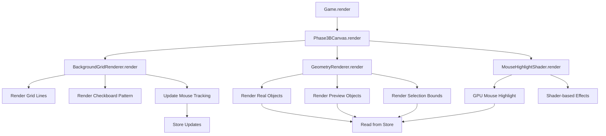
```mermaid
graph TD
    A[Game.render] --> B[Phase3BCanvas.render]
    B --> C[BackgroundGridRenderer.render]
    B --> D[GeometryRenderer.render]
    B --> E[MouseHighlightShader.render]
    
    C --> C1[Render Grid Lines]
    C --> C2[Render Checkboard Pattern]
    C --> C3[Update Mouse Tracking]
    
    D --> D1[Render Real Objects]
    D --> D2[Render Preview Objects]
    D --> D3[Render Selection Bounds]
    
    E --> E1[GPU Mouse Highlight]
    E --> E2[Shader-based Effects]
    
    C3 --> F[Store Updates]
    D1 --> G[Read from Store]
    D2 --> G
    D3 --> G
    E1 --> G
```

### 1.2 Store-Driven Rendering Pattern
Each renderer reads from specific store slices:

- **BackgroundGridRenderer** reads `gameStore.ui.showGrid`, `gameStore.ui.enableCheckboard`
- **GeometryRenderer** reads `gameStore.objects`, `gameStore.selection`, `gameStore.preview`
- **MouseHighlightShader** reads `gameStore.ui.mouse.highlightColor`, `gameStore.mouse.position`

## 2. User Input Flow Analysis

### 2.1 Mouse Input Flow
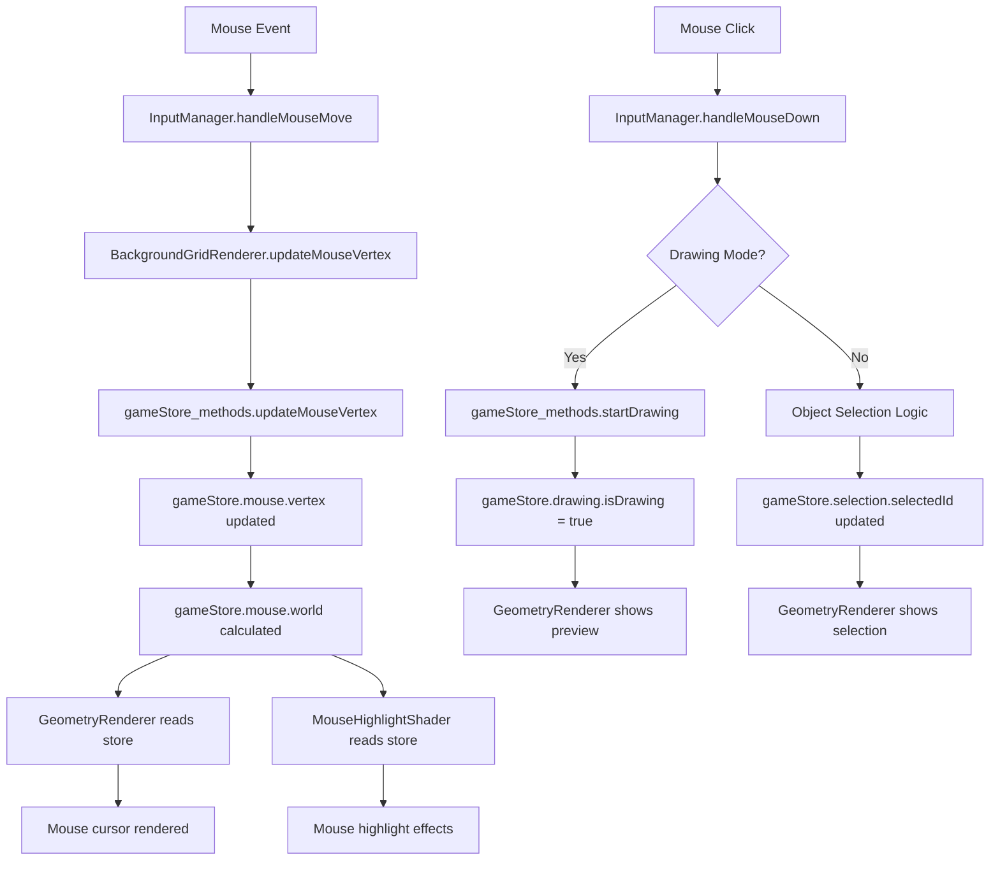
```mermaid
graph TD
    A[Mouse Event] --> B[InputManager.handleMouseMove]
    B --> C[BackgroundGridRenderer.updateMouseVertex]
    C --> D[gameStore_methods.updateMouseVertex]
    D --> E[gameStore.mouse.vertex updated]
    E --> F[gameStore.mouse.world calculated]
    
    F --> G[GeometryRenderer reads store]
    F --> H[MouseHighlightShader reads store]
    G --> I[Mouse cursor rendered]
    H --> J[Mouse highlight effects]
    
    A2[Mouse Click] --> B2[InputManager.handleMouseDown]
    B2 --> C2{Drawing Mode?}
    C2 -->|Yes| D2[gameStore_methods.startDrawing]
    C2 -->|No| E2[Object Selection Logic]
    
    D2 --> F2[gameStore.drawing.isDrawing = true]
    E2 --> F3[gameStore.selection.selectedId updated]
    
    F2 --> G2[GeometryRenderer shows preview]
    F3 --> G3[GeometryRenderer shows selection]
```

### 2.2 Keyboard Input Flow
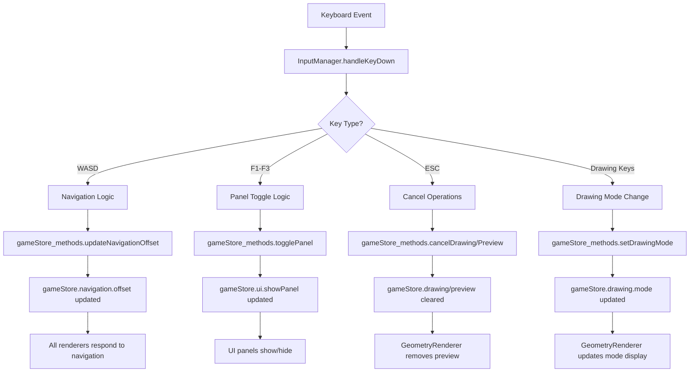
```mermaid
graph TD
    A[Keyboard Event] --> B[InputManager.handleKeyDown]
    B --> C{Key Type?}
    
    C -->|WASD| D[Navigation Logic]
    C -->|F1-F3| E[Panel Toggle Logic]
    C -->|ESC| F[Cancel Operations]
    C -->|Drawing Keys| G[Drawing Mode Change]
    
    D --> D1[gameStore_methods.updateNavigationOffset]
    E --> E1[gameStore_methods.togglePanel]
    F --> F1[gameStore_methods.cancelDrawing/Preview]
    G --> G1[gameStore_methods.setDrawingMode]
    
    D1 --> H[gameStore.navigation.offset updated]
    E1 --> I[gameStore.ui.showPanel updated]
    F1 --> J[gameStore.drawing/preview cleared]
    G1 --> K[gameStore.drawing.mode updated]
    
    H --> L[All renderers respond to navigation]
    I --> M[UI panels show/hide]
    J --> N[GeometryRenderer removes preview]
    K --> O[GeometryRenderer updates mode display]
```

## 3. UI Panel Interaction Flow

### 3.1 GeometryPanel → Store → Rendering
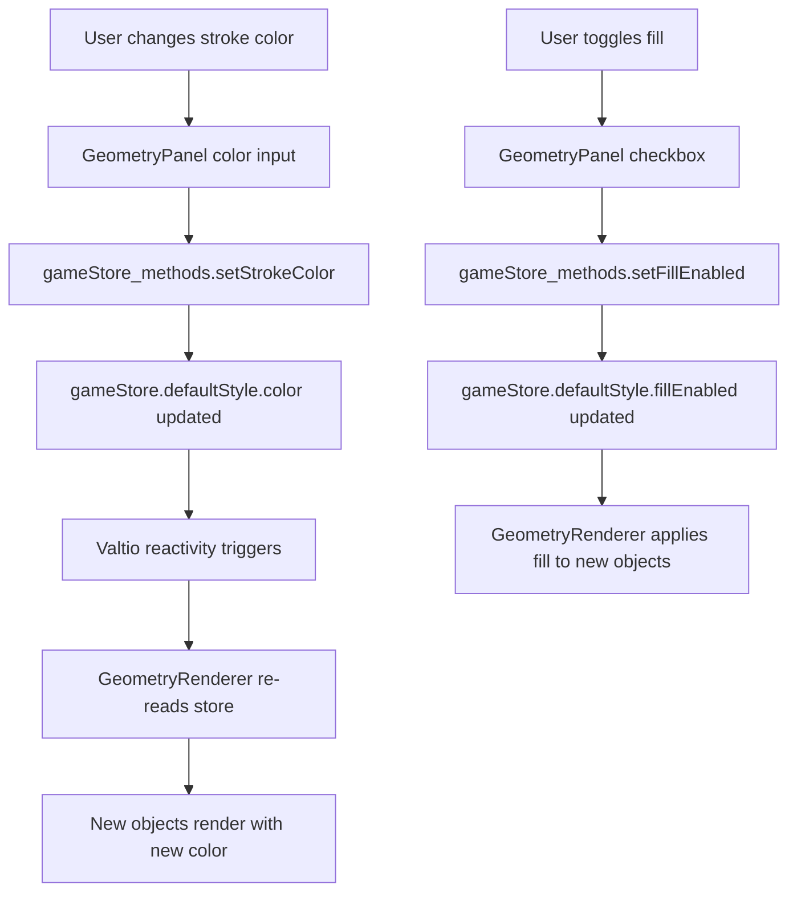
```mermaid
graph TD
    A[User changes stroke color] --> B[GeometryPanel color input]
    B --> C[gameStore_methods.setStrokeColor]
    C --> D[gameStore.defaultStyle.color updated]
    D --> E[Valtio reactivity triggers]
    E --> F[GeometryRenderer re-reads store]
    F --> G[New objects render with new color]
    
    H[User toggles fill] --> I[GeometryPanel checkbox]
    I --> J[gameStore_methods.setFillEnabled]
    J --> K[gameStore.defaultStyle.fillEnabled updated]
    K --> L[GeometryRenderer applies fill to new objects]
```

### 3.2 ObjectEditPanel → Preview System → Rendering
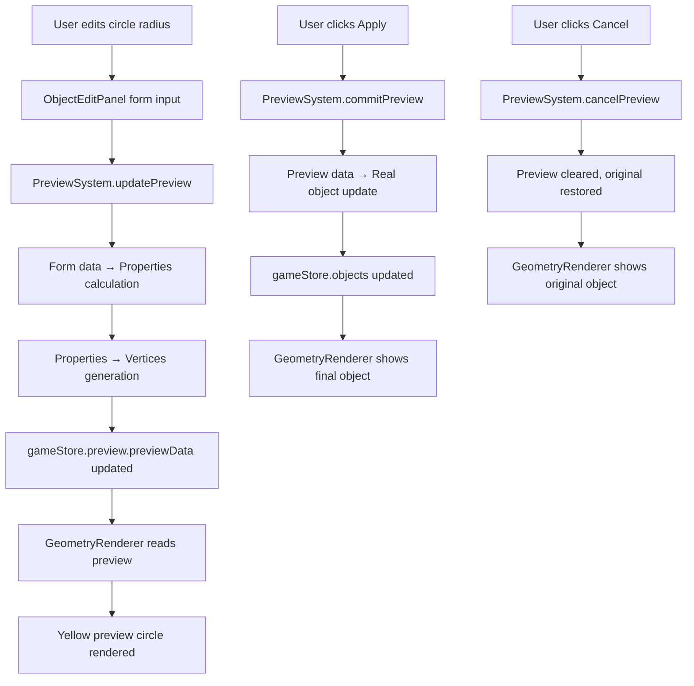
```mermaid
graph TD
    A[User edits circle radius] --> B[ObjectEditPanel form input]
    B --> C[PreviewSystem.updatePreview]
    C --> D[Form data → Properties calculation]
    D --> E[Properties → Vertices generation]
    E --> F[gameStore.preview.previewData updated]
    F --> G[GeometryRenderer reads preview]
    G --> H[Yellow preview circle rendered]
    
    I[User clicks Apply] --> J[PreviewSystem.commitPreview]
    J --> K[Preview data → Real object update]
    K --> L[gameStore.objects updated]
    L --> M[GeometryRenderer shows final object]
    
    N[User clicks Cancel] --> O[PreviewSystem.cancelPreview]
    O --> P[Preview cleared, original restored]
    P --> Q[GeometryRenderer shows original object]
```

### 3.3 LayerToggleBar → Store → Rendering
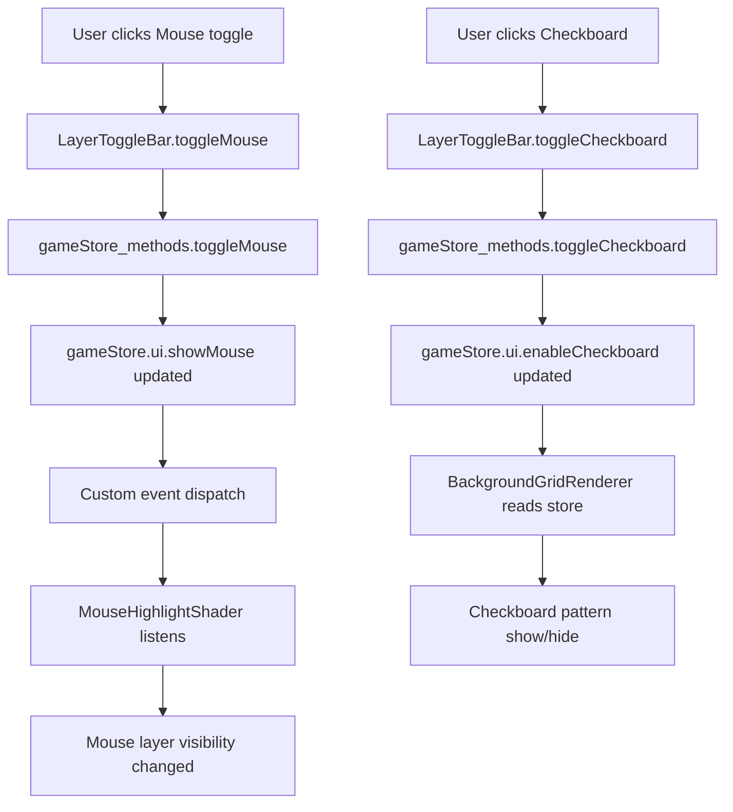
```mermaid
graph TD
    A[User clicks Mouse toggle] --> B[LayerToggleBar.toggleMouse]
    B --> C[gameStore_methods.toggleMouse]
    C --> D[gameStore.ui.showMouse updated]
    D --> E[Custom event dispatch]
    E --> F[MouseHighlightShader listens]
    F --> G[Mouse layer visibility changed]
    
    H[User clicks Checkboard] --> I[LayerToggleBar.toggleCheckboard]
    I --> J[gameStore_methods.toggleCheckboard]
    J --> K[gameStore.ui.enableCheckboard updated]
    K --> L[BackgroundGridRenderer reads store]
    L --> M[Checkboard pattern show/hide]
```

## 4. Bidirectional Store-Geometry Relationships

### 4.1 Store → Geometry (Data Flow)
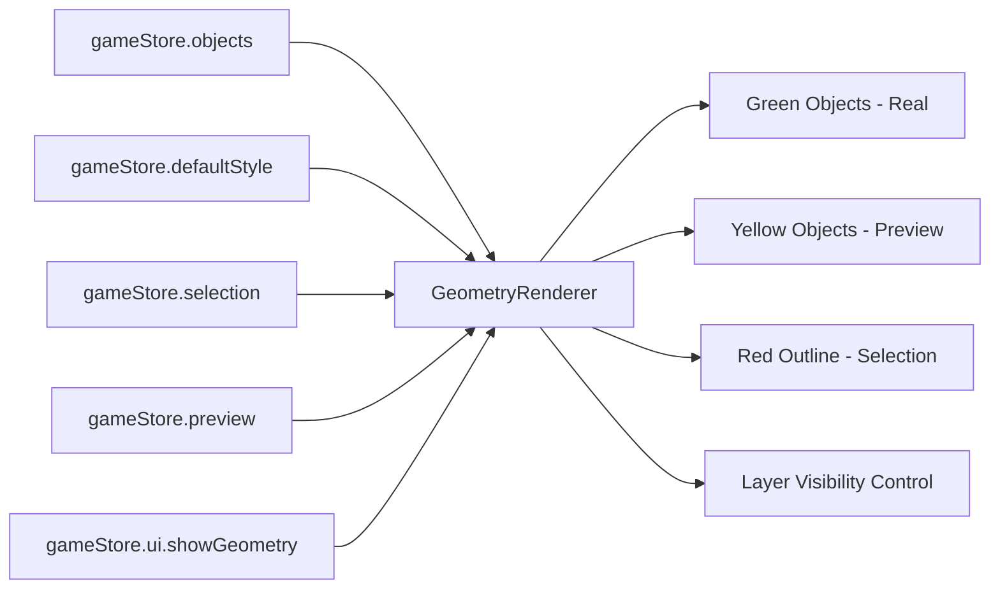
```mermaid
graph LR
    A[gameStore.objects] --> B[GeometryRenderer]
    C[gameStore.defaultStyle] --> B
    D[gameStore.selection] --> B
    E[gameStore.preview] --> B
    F[gameStore.ui.showGeometry] --> B
    
    B --> G[Green Objects - Real]
    B --> H[Yellow Objects - Preview]
    B --> I[Red Outline - Selection]
    B --> J[Layer Visibility Control]
```

### 4.2 Geometry → Store (Update Flow)
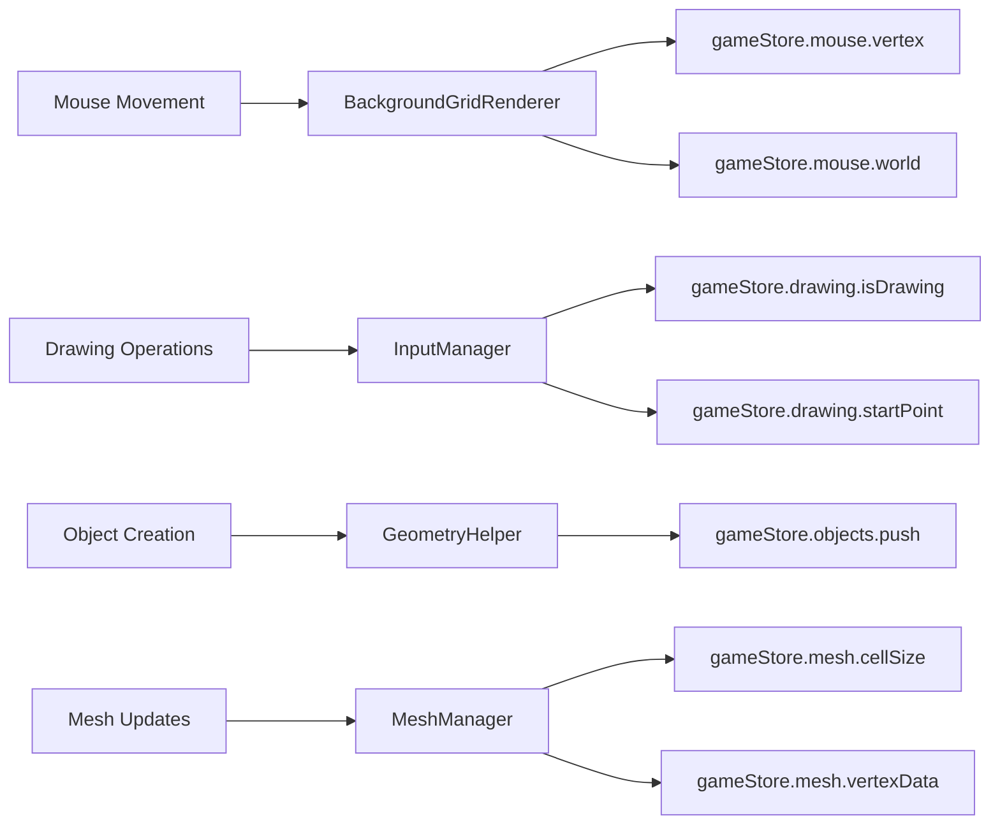
```mermaid
graph LR
    A[Mouse Movement] --> B[BackgroundGridRenderer]
    B --> C[gameStore.mouse.vertex]
    B --> D[gameStore.mouse.world]
    
    E[Drawing Operations] --> F[InputManager]
    F --> G[gameStore.drawing.isDrawing]
    F --> H[gameStore.drawing.startPoint]
    
    I[Object Creation] --> J[GeometryHelper]
    J --> K[gameStore.objects.push]
    
    L[Mesh Updates] --> M[MeshManager]
    M --> N[gameStore.mesh.cellSize]
    M --> O[gameStore.mesh.vertexData]
```

### 4.3 Circular Dependencies Resolution
The system avoids circular dependencies through:

1. **Forward-Only Calculations**: Properties always calculated from vertices, never reverse-engineered
2. **Store Authority**: Store is always the single source of truth
3. **Action-Based Updates**: All mutations go through `gameStore_methods`
4. **Reactive Updates**: Valtio handles automatic re-rendering

## 5. Coordinate System Flow

### 5.1 Multi-Coordinate Transformation Pipeline
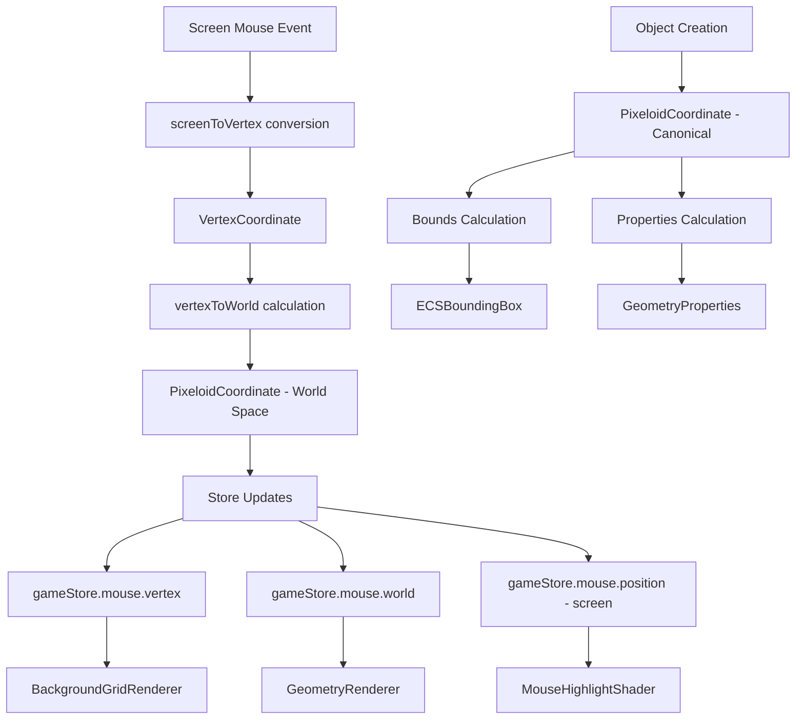
```mermaid
graph TD
    A[Screen Mouse Event] --> B[screenToVertex conversion]
    B --> C[VertexCoordinate]
    C --> D[vertexToWorld calculation]
    D --> E[PixeloidCoordinate - World Space]
    
    E --> F[Store Updates]
    F --> G[gameStore.mouse.vertex]
    F --> H[gameStore.mouse.world]
    F --> I[gameStore.mouse.position - screen]
    
    G --> J[BackgroundGridRenderer]
    H --> K[GeometryRenderer]
    I --> L[MouseHighlightShader]
    
    M[Object Creation] --> N[PixeloidCoordinate - Canonical]
    N --> O[Bounds Calculation]
    N --> P[Properties Calculation]
    O --> Q[ECSBoundingBox]
    P --> R[GeometryProperties]
```

### 5.2 Coordinate Authority Pattern
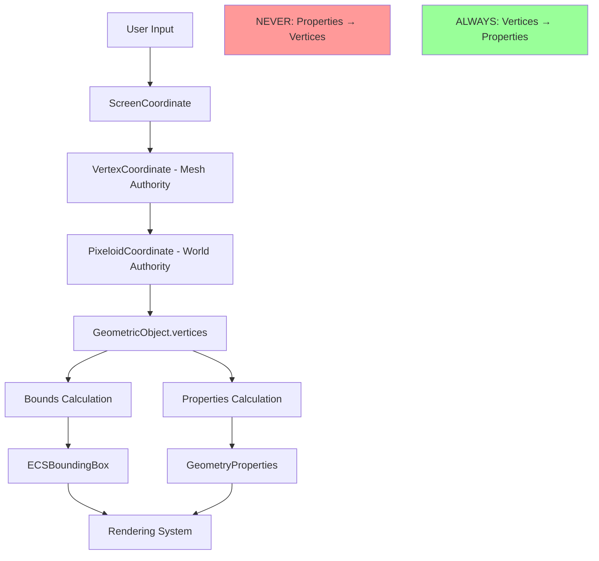
```mermaid
graph TD
    A[User Input] --> B[ScreenCoordinate]
    B --> C[VertexCoordinate - Mesh Authority]
    C --> D[PixeloidCoordinate - World Authority]
    
    D --> E[GeometricObject.vertices]
    E --> F[Bounds Calculation]
    E --> G[Properties Calculation]
    
    F --> H[ECSBoundingBox]
    G --> I[GeometryProperties]
    
    H --> J[Rendering System]
    I --> J
    
    K[NEVER: Properties → Vertices] 
    L[ALWAYS: Vertices → Properties]
    
    style K fill:#ff9999
    style L fill:#99ff99
```

## 6. Preview System Architecture

### 6.1 Preview State Machine
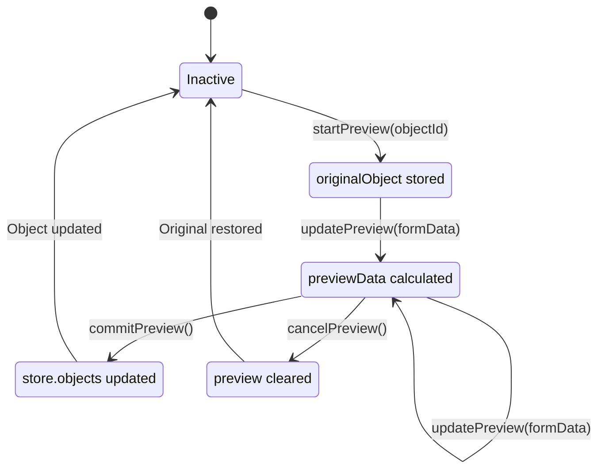
```mermaid
stateDiagram-v2
    [*] --> Inactive
    
    Inactive --> EditMode : startPreview(objectId)
    EditMode --> PreviewActive : updatePreview(formData)
    PreviewActive --> PreviewActive : updatePreview(formData)
    PreviewActive --> Committed : commitPreview()
    PreviewActive --> Cancelled : cancelPreview()
    
    Committed --> Inactive : Object updated
    Cancelled --> Inactive : Original restored
    
    EditMode : originalObject stored
    PreviewActive : previewData calculated
    Committed : store.objects updated
    Cancelled : preview cleared
```

### 6.2 Preview Data Flow (Circle Edit Example)
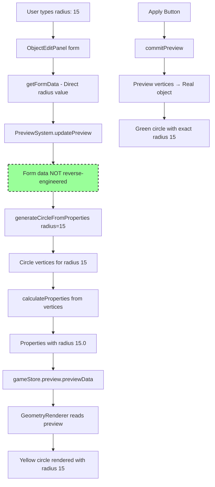
```mermaid
graph TD
    A[User types radius: 15] --> B[ObjectEditPanel form]
    B --> C[getFormData - Direct radius value]
    C --> D[PreviewSystem.updatePreview]
    
    D --> E[Form data NOT reverse-engineered]
    E --> F[generateCircleFromProperties radius=15]
    F --> G[Circle vertices for radius 15]
    G --> H[calculateProperties from vertices]
    H --> I[Properties with radius 15.0]
    
    I --> J[gameStore.preview.previewData]
    J --> K[GeometryRenderer reads preview]
    K --> L[Yellow circle rendered with radius 15]
    
    M[Apply Button] --> N[commitPreview]
    N --> O[Preview vertices → Real object]
    O --> P[Green circle with exact radius 15]
    
    style E fill:#99ff99,stroke:#333,stroke-width:2px
    style E stroke-dasharray: 5 5
```

## 7. Error Prevention Patterns

### 7.1 Circle Movement Bug Prevention
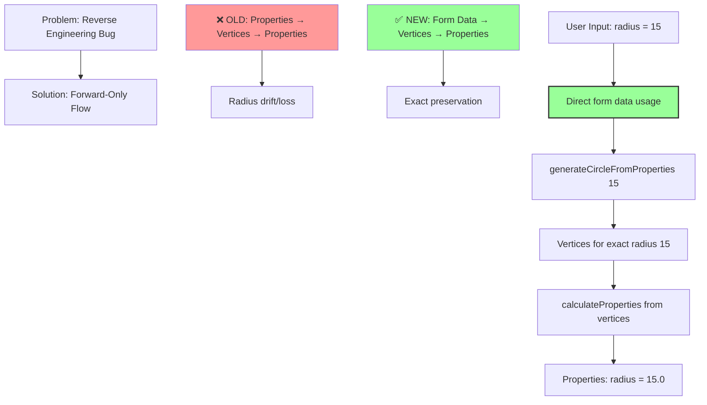
```mermaid
graph TD
    A[Problem: Reverse Engineering Bug] --> B[Solution: Forward-Only Flow]
    
    C[❌ OLD: Properties → Vertices → Properties] --> D[Radius drift/loss]
    E[✅ NEW: Form Data → Vertices → Properties] --> F[Exact preservation]
    
    G[User Input: radius = 15] --> H[Direct form data usage]
    H --> I[generateCircleFromProperties 15]
    I --> J[Vertices for exact radius 15]
    J --> K[calculateProperties from vertices]
    K --> L[Properties: radius = 15.0]
    
    style C fill:#ff9999
    style E fill:#99ff99
    style H fill:#99ff99,stroke:#333,stroke-width:2px
```

### 7.2 Store Integrity Patterns
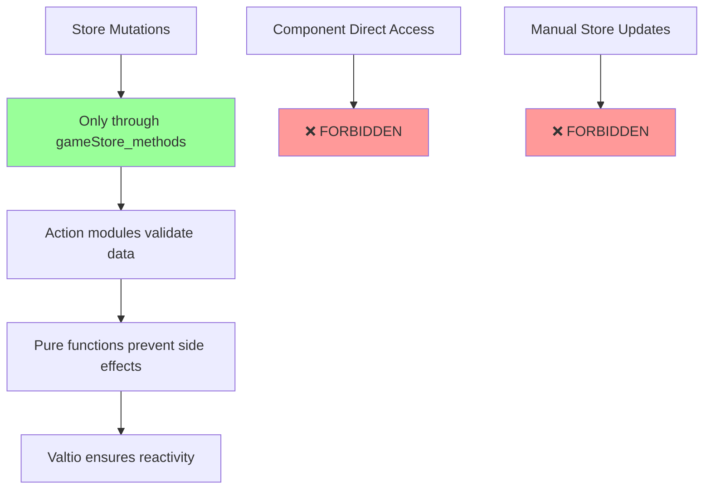
```mermaid
graph TD
    A[Store Mutations] --> B[Only through gameStore_methods]
    B --> C[Action modules validate data]
    C --> D[Pure functions prevent side effects]
    D --> E[Valtio ensures reactivity]
    
    F[Component Direct Access] --> G[❌ FORBIDDEN]
    H[Manual Store Updates] --> I[❌ FORBIDDEN]
    
    style G fill:#ff9999
    style I fill:#ff9999
    style B fill:#99ff99
```

## 8. Performance Optimization Patterns

### 8.1 Selective Store Subscriptions
```mermaid
graph TD
    A[UI Component] --> B[subscribe to specific slice]
    B --> C[Only relevant updates trigger re-render]
    
    D[StorePanel] --> E[subscribe(gameStore.mouse)]
    D --> F[subscribe(gameStore.navigation)]
    D --> G[subscribe(gameStore.mesh)]
    
    H[GeometryPanel] --> I[subscribe(gameStore.defaultStyle)]
    H --> J[subscribe(gameStore.drawing)]
    
    K[GeometryRenderer] --> L[subscribe(gameStore.objects)]
    K --> M[subscribe(gameStore.selection)]
    K --> N[subscribe(gameStore.preview)]
```

### 8.2 GPU Shader Integration
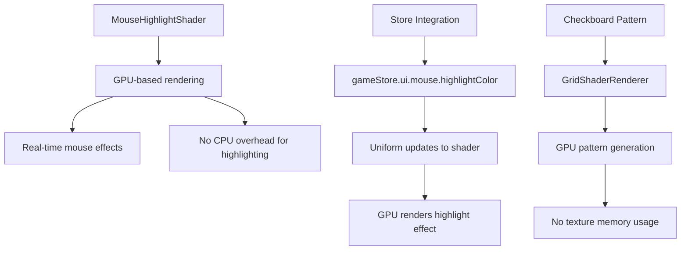
```mermaid
graph TD
    A[MouseHighlightShader] --> B[GPU-based rendering]
    B --> C[Real-time mouse effects]
    B --> D[No CPU overhead for highlighting]
    
    E[Store Integration] --> F[gameStore.ui.mouse.highlightColor]
    F --> G[Uniform updates to shader]
    G --> H[GPU renders highlight effect]
    
    I[Checkboard Pattern] --> J[GridShaderRenderer]
    J --> K[GPU pattern generation]
    K --> L[No texture memory usage]
```

## 9. Architecture Success Factors

### 9.1 Single Source of Truth
- **All state** flows through `gameStore`
- **No component-specific state** duplication
- **Valtio reactivity** ensures automatic updates

### 9.2 Action-Based Mutations
- **Store changes** only through `gameStore_methods`
- **Pure functions** in action modules
- **Predictable state transitions**

### 9.3 Forward-Only Data Flow
- **Properties** always calculated from vertices
- **No reverse engineering** prevents bugs
- **Form data** used directly for user input

### 9.4 Modular Composition
- **Dependency injection** from Game → Canvas → Renderers
- **Clean separation** of concerns
- **Testable components** with clear interfaces

### 9.5 ECS-Inspired Coordinate System
- **Multiple coordinate spaces** with clear transformations
- **PixeloidCoordinate** as canonical world space
- **Type safety** prevents coordinate mixing

## 10. Critical Data Flow Insights

### 10.1 The Great Circle Bug Fix
The circle editing bug was caused by reverse engineering radius from vertices, causing precision loss. The fix ensures:

1. **Form data** used directly (no calculations)
2. **Properties** generated from form data
3. **Vertices** generated from properties  
4. **Store** updated with vertices
5. **Renderer** shows exact user input

### 10.2 Preview System as Architecture Model
The preview system demonstrates perfect data flow:

1. **Original preserved** for cancel operations
2. **Preview calculated** separately from real data
3. **Visual feedback** before commitment
4. **Single commit** updates real store
5. **Clean state transitions**

### 10.3 Bidirectional Flow Without Chaos
The system achieves bidirectional data flow while maintaining predictability:

1. **User Input → Store → Rendering** (main flow)
2. **Rendering → Store** (mouse tracking, mesh updates)
3. **Store Authority** prevents circular dependencies
4. **Action Modules** centralize all mutations

## Summary

This system demonstrates a sophisticated **Event-Driven Architecture** with:

- **Unified Store** as the single source of truth
- **Multi-coordinate system** for pixel-perfect rendering
- **Preview-first editing** with visual feedback
- **GPU shader integration** for performance
- **Forward-only data flow** preventing precision bugs
- **Modular composition** with clean dependencies
- **Reactive UI updates** through Valtio
- **Action-based mutations** for predictability

The architecture successfully handles complex geometry editing, real-time preview, coordinate transformations, and pixel-perfect rendering while maintaining clean data flow and preventing common architectural pitfalls.