# Mouse System Debug Analysis

## Current Mouse Pipeline Issues

After analyzing the mouse detection and shader system, I've identified several critical bugs that explain the offset and update problems you're experiencing.

## 🚨 Critical Issues Identified

### 1. **HIDDEN SCALING FACTOR: `cellSize = 20`**

**Location**: `app/src/game/MeshManager.ts` line 15-17
```typescript
private get cellSize(): number {
  return this.store.mesh.cellSize  // ← This defaults to 20!
}
```

**Location**: `app/src/store/game-store.ts` line 124-128
```typescript
mesh: {
  cellSize: 20,  // ← HERE'S THE HIDDEN SCALE!
  vertexData: null,
  dimensions: null,
  needsUpdate: false
}
```

**Problem**: The mesh system uses `cellSize = 20` which creates a 20x scaling factor between screen pixels and vertex coordinates. This explains why the mouse highlight appears larger and offset.

### 2. **MOUSE POSITION ONLY UPDATES ON CLICK (NOT MOVE)**

**Location**: `app/src/game/BackgroundGridRenderer.ts` lines 63-83 vs 86-97

```typescript
// ✅ Updates on MOVE
mesh.on('globalpointermove', (event) => {
  // ...
  gameStore_methods.updateMouseVertex(vertexCoord.x, vertexCoord.y)  // ← Only vertex
  // ...
})

// ❌ Only updates on CLICK
mesh.on('pointerdown', (event) => {
  // ...
  gameStore_methods.updateMousePosition(vertexCoord.x, vertexCoord.y)  // ← Screen/world
  // ...
})
```

**Problem**: `mouse.position` and `mouse.world` coordinates only update when you click, not when you move the mouse. This is why the StorePanel shows stale position data.

### 3. **COORDINATE SYSTEM PIPELINE BREAKDOWN**

Here's how the mouse coordinates SHOULD work vs how they ACTUALLY work:

#### **Expected Coordinate Flow** (Scale 1):
```
Screen Event → Mesh Local Position → Vertex Coords → Store Updates
Mouse (100,150) → Mesh (100,150) → Vertex (100,150) → Store vertex/screen/world
```

#### **Actual Coordinate Flow** (Scale 20):
```
Screen Event → Mesh Local Position → Vertex Coords (÷20) → Store Updates
Mouse (100,150) → Mesh (100,150) → Vertex (5,7) → Store vertex=5,7
                                                  → Store screen/world=STALE!
```

## 🔍 Detailed Mouse Pipeline Analysis

### Pipeline Step 1: Event Capture
**File**: `BackgroundGridRenderer.ts:63-82`
```typescript
mesh.on('globalpointermove', (event) => {
  const localPos = event.getLocalPosition(mesh)           // ← Screen pixels
  const vertexCoord = {
    x: Math.floor(localPos.x),                           // ← Still screen pixels
    y: Math.floor(localPos.y)
  }
  
  gameStore_methods.updateMouseVertex(vertexCoord.x, vertexCoord.y)  // ← NOT vertices!
})
```

**BUG**: The "vertexCoord" is actually still in screen pixels! The conversion happens later.

### Pipeline Step 2: Store Updates
**File**: `EditActions.ts:134-145`
```typescript
export const updateMouseVertex = (store: GameStoreData, x: number, y: number): void => {
  store.mouse.vertex = { x, y }  // ← Storing screen pixels as "vertex"
}

export const updateMousePosition = (store: GameStoreData, x: number, y: number): void => {
  store.mouse.position = { x, y }     // ← Only called on CLICK
  store.mouse.world = {               // ← Only calculated on CLICK
    x: x + store.navigation.offset.x,
    y: y + store.navigation.offset.y
  }
}
```

**BUG**: `updateMousePosition` should be called on MOVE, not just CLICK.

### Pipeline Step 3: Screen-to-Vertex Conversion
**File**: `MeshManager.ts:83-88`
```typescript
public screenToVertex(screenX: number, screenY: number): VertexCoordinate {
  const cellSize = this.cellSize  // ← cellSize = 20
  const vertexX = Math.floor(screenX / cellSize)  // ← Division by 20!
  const vertexY = Math.floor(screenY / cellSize)
  return { x: vertexX, y: vertexY }
}
```

**This conversion is ONLY used in `pointerdown`, not `globalpointermove`!**

## 🎯 Root Cause Analysis

### Issue 1: Scale Mismatch
- **Mesh coordinates**: Screen pixels (100, 150)
- **"Vertex" coordinates**: Still screen pixels (100, 150) - NOT divided by cellSize
- **Expected vertex coordinates**: Should be (5, 7) if cellSize=20
- **Mouse shader**: Receives screen pixels but expects vertex coordinates

### Issue 2: Update Frequency
- **Vertex position**: Updates on every mouse move ✅
- **Screen position**: Only updates on click ❌
- **World position**: Only updates on click ❌

### Issue 3: Coordinate System Confusion
The system has 3 coordinate systems but they're inconsistently used:

1. **Screen Coordinates**: Raw pixel events from browser
2. **Vertex Coordinates**: Screen coordinates ÷ cellSize (should be)
3. **World Coordinates**: Vertex coordinates + navigation offset

## 📋 How Mouse System SHOULD Work

### Correct Pipeline (Scale 1 Target):


### Current Broken Pipeline:

```mermaid
graph LR
    A[Mouse Event<br/>screen: 100,150] --> B[Mesh Local Position<br/>local: 100,150]
    B --> C[MOVE: Store as 'vertex'<br/>vertex: 100,150 ❌]
    B --> D[CLICK: Convert to vertex<br/>vertex: 5,7 ✅]
    C --> E[Shader gets wrong coords<br/>20x scale mismatch]
    D --> F[Store screen/world<br/>only on click ❌]
```


## 🔧 Required Fixes

### Fix 1: Correct Coordinate Conversion on Move
**File**: `BackgroundGridRenderer.ts:63-82`
```typescript
// BEFORE (broken):
const vertexCoord = {
  x: Math.floor(localPos.x),
  y: Math.floor(localPos.y)
}

// AFTER (fixed):
const vertexCoord = this.meshManager.screenToVertex(localPos.x, localPos.y)
```

### Fix 2: Update All Mouse Coordinates on Move
**File**: `BackgroundGridRenderer.ts:63-82`
```typescript
// ADD this call in globalpointermove:
gameStore_methods.updateMousePosition(vertexCoord.x, vertexCoord.y)
```

### Fix 3: Set cellSize to 1 for Scale 1
**File**: `game-store.ts:124`
```typescript
mesh: {
  cellSize: 1,  // ← Change from 20 to 1
  // ...
}
```

### Fix 4: Separate Click Tracking
Add a new state for tracking last click position separately from mouse position:
```typescript
lastClick: {
  position: PixeloidCoordinate | null,
  timestamp: number
}
```

## 🎯 Summary

The mouse system has **THREE major bugs**:

1. **Hidden 20x scale factor** from `cellSize = 20`
2. **Mouse position only updates on click, not move**
3. **Inconsistent coordinate conversion** between move and click events

These bugs combine to create the offset and stale data issues you're observing.