# Phase 3B Architecture Deep Analysis

## Executive Summary

This document provides a comprehensive analysis of the Phase 3B architecture, focusing on the store/game interaction patterns, object creation workflows, input handling mechanisms, and mesh system operations. The analysis reveals a well-designed, modular system with excellent separation of concerns and circle bug prevention built-in.

## Table of Contents

1. [Core Architecture Overview](#core-architecture-overview)
2. [Store System Architecture](#store-system-architecture)
3. [Object Creation Workflow](#object-creation-workflow)
4. [Input Handling System](#input-handling-system)
5. [Mesh System Architecture](#mesh-system-architecture)
6. [Component Interaction Patterns](#component-interaction-patterns)
7. [Circle Bug Prevention Analysis](#circle-bug-prevention-analysis)
8. [Data Flow Analysis](#data-flow-analysis)

---

## Core Architecture Overview

The Phase 3B architecture follows a **Clean Architecture** pattern with strict dependency inversion and modular design:

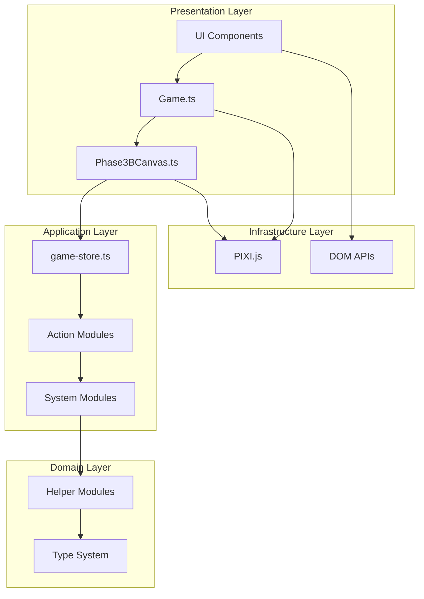

### Key Architectural Principles

1. **Single Source of Truth**: `game-store.ts` as unified state manager
2. **Dependency Injection**: Game creates and injects InputManager into Phase3BCanvas
3. **Action Dispatch**: Store methods dispatch to modular action files
4. **Circle Bug Prevention**: Forward-only calculations with no reverse engineering
5. **Mesh-First Architecture**: Mesh events are authoritative coordinate source

---

## Store System Architecture

### Core Store Structure

The store system is built around a **modular dispatch pattern** with clear separation of concerns:

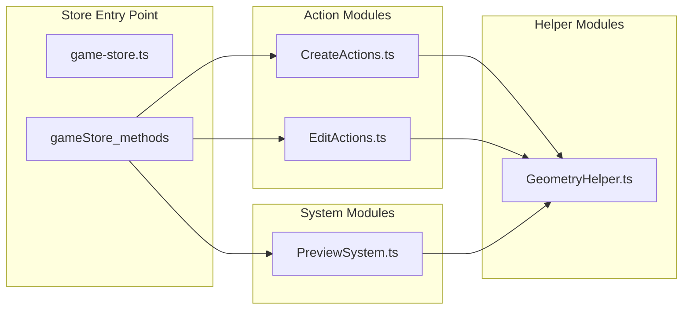

### Store State Management

The `GameStoreData` interface defines a comprehensive state structure:

```typescript
// Core object storage
objects: GeometricObject[]           // Single source of truth for all geometry

// Selection system
selection: {
  selectedId: string | null
  selectionBounds: ECSBoundingBox | null
}

// Preview system (circle bug prevention)
preview: ObjectEditPreviewState

// Drawing system
drawing: {
  mode: DrawingMode
  isDrawing: boolean
  startPoint: PixeloidCoordinate | null
  currentPoint: PixeloidCoordinate | null
}

// Style management
defaultStyle: StyleSettings
objectStyles: Record<string, Partial<StyleSettings>>

// UI state
ui: { /* comprehensive UI state */ }

// Mouse tracking (dual coordinate system)
mouse: {
  position: PixeloidCoordinate      // Screen coordinates
  vertex: VertexCoordinate          // Mesh vertex coordinates  
  world: PixeloidCoordinate         // World coordinates
}

// Navigation
navigation: {
  offset: PixeloidCoordinate
  isDragging: boolean
}

// Clipboard & Dragging
clipboard: { /* copy/paste state */ }
dragging: { /* drag operation state */ }

// Mesh configuration
mesh: {
  cellSize: number
  vertexData: Float32Array | null
  dimensions: { width: number, height: number } | null
}
```

### Action Dispatch Pattern

The store uses a **clean dispatch pattern** to route operations to specialized modules:

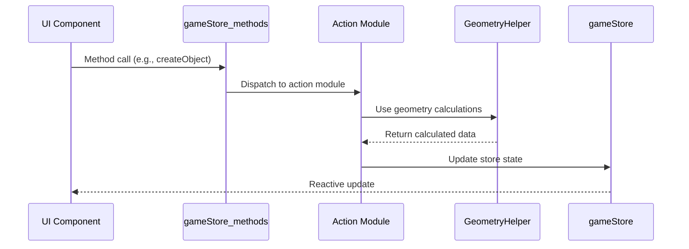

---

## Object Creation Workflow

### Creation Flow Analysis

The object creation system uses a **forward-only calculation pattern** to prevent the circle bug:

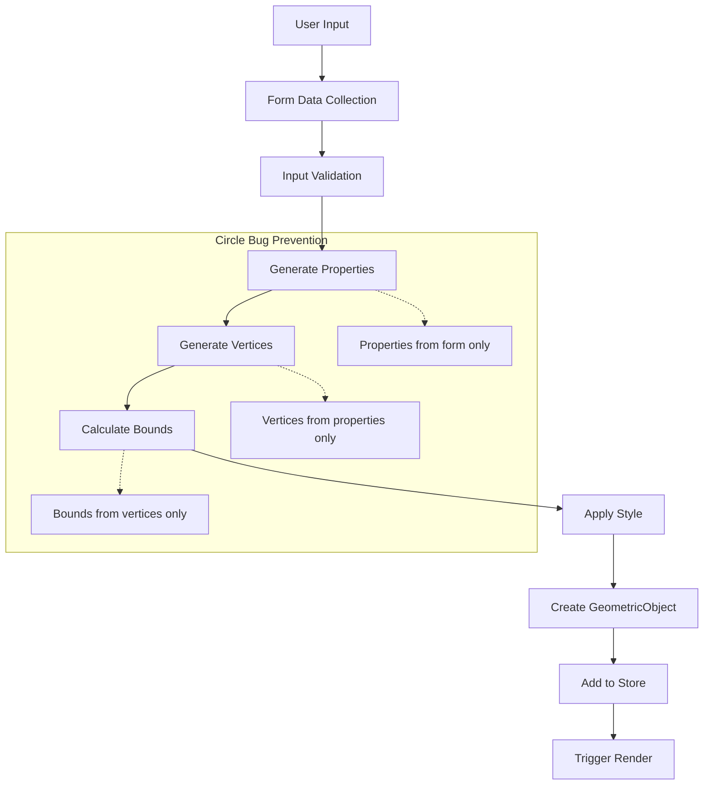

### Creation Paths

#### 1. Drawing System Creation
```typescript
// Drawing workflow
gameStore_methods.startDrawing(startPoint)
gameStore_methods.updateDrawing(currentPoint)  // Updates preview only
gameStore_methods.finishDrawing()              // Commits to store

// Internal flow:
// 1. PreviewSystem.startPreview()
// 2. PreviewSystem.updatePreview() - uses GeometryHelper
// 3. PreviewSystem.commitPreview() - creates actual object
```

#### 2. Direct Creation
```typescript
// Direct creation workflow
gameStore_methods.createObject({
  type: 'circle',
  properties: { center: {x: 10, y: 10}, radius: 5 },
  style: defaultStyle
})

// Internal flow:
// 1. CreateActions.createObject()
// 2. GeometryHelper.generateVertices() - forward calculation
// 3. GeometryHelper.calculateBounds()
// 4. Add to store.objects[]
```

### Critical Circle Bug Prevention

The **key insight** of this architecture is that it prevents the circle bug through **strict forward-only calculations**:

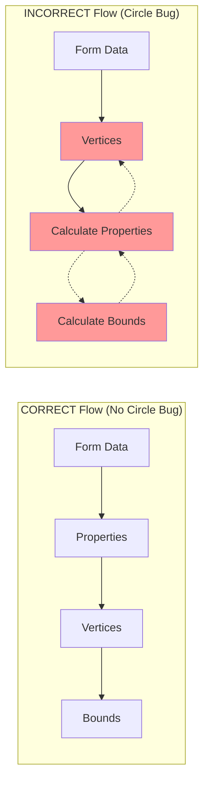

---

## Input Handling System

### Input Architecture

The input system uses a **clean detection and routing pattern**:

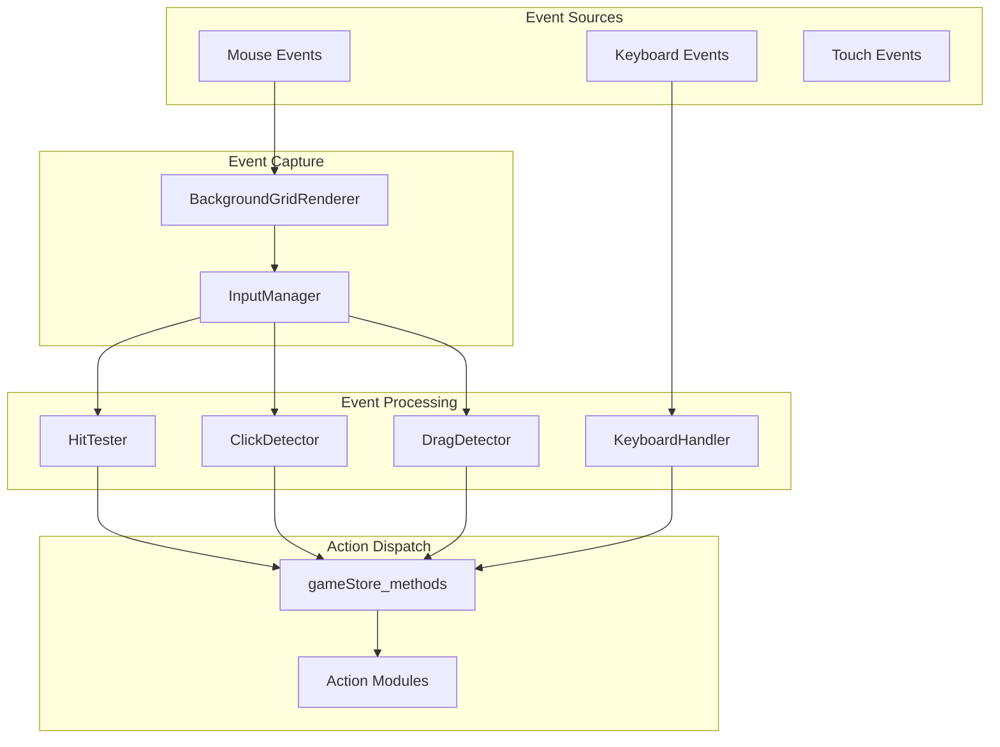

### Input Flow Analysis

#### 1. Mesh-First Event Capture
```typescript
// BackgroundGridRenderer.ts - Authoritative coordinate source
mesh.on('globalpointermove', (event) => {
  const localPos = event.getLocalPosition(mesh)  // AUTHORITATIVE
  const vertexCoord = {
    x: Math.floor(localPos.x),
    y: Math.floor(localPos.y)
  }
  
  // IMMEDIATE dual updates
  mouseHighlightShader.updateFromMesh(vertexCoord)      // GPU
  gameStore_methods.updateMouseVertex(vertexCoord.x, vertexCoord.y)  // Store
  
  // Route to InputManager
  this.handleGeometryInput('move', vertexCoord, event)
})
```

#### 2. Input Detection and Classification
```typescript
// InputManager.ts - Safe input detection
public handleMouseDown(coord: PixeloidCoordinate, event: FederatedMouseEvent): void {
  const hitObjectId = this.hitTester.getObjectAtPosition(coord)
  const clickType = this.clickDetector.handleMouseDown(coord)
  
  if (gameStore.drawing.mode === 'none') {
    this.handleSelectionMode(hitObjectId, coord, clickType, event)
  } else {
    this.handleDrawingMode(hitObjectId, coord, clickType, event)
  }
}
```

#### 3. Safe Mode Routing
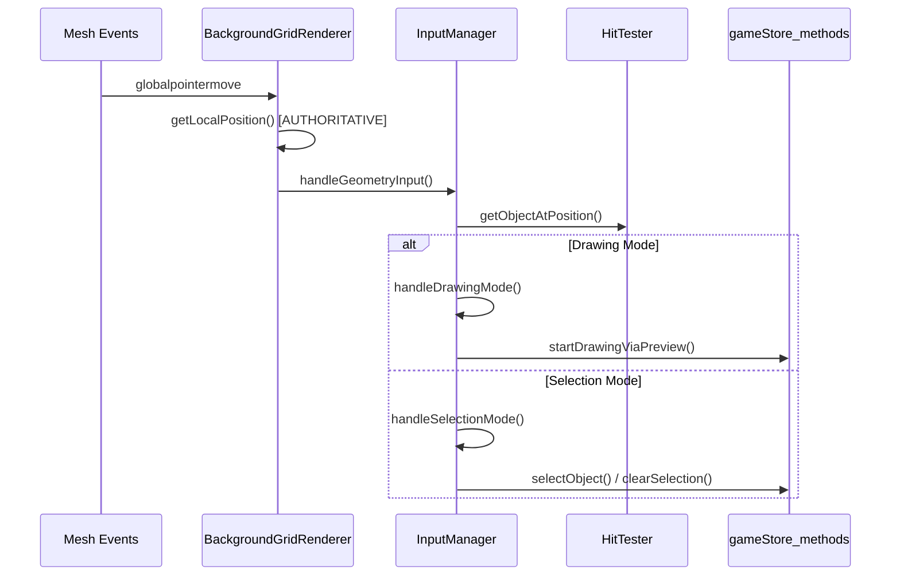

### Input System Components

#### HitTester - Safe Object Detection
```typescript
public getObjectAtPosition(coord: PixeloidCoordinate): string | null {
  // Test objects from top to bottom (last drawn first)
  for (let i = gameStore.objects.length - 1; i >= 0; i--) {
    const obj = gameStore.objects[i]
    if (obj.isVisible !== false && this.hitTestObject(obj, coord)) {
      return obj.id
    }
  }
  return null
}
```

#### ClickDetector - Timing Analysis
```typescript
public handleMouseDown(coord: PixeloidCoordinate): 'single-click' | 'double-click' {
  const now = Date.now()
  const isNearLastClick = this.lastClickPosition && 
    this.isWithinPositionThreshold(coord, this.lastClickPosition)
  
  if (isNearLastClick && (now - this.lastClickTime) < this.doubleClickThreshold) {
    return 'double-click'
  } else {
    return 'single-click'
  }
}
```

#### DragDetector - Movement Threshold
```typescript
public handleMouseMove(coord: PixeloidCoordinate): 'hover' | 'drag-start' | 'drag-continue' {
  if (!this.dragStartPosition) {
    this.dragStartPosition = coord
    return 'hover'
  }
  
  const exceeds = this.exceedsThreshold(this.dragStartPosition, coord)
  
  if (!this._isDragging && exceeds) {
    this._isDragging = true
    return 'drag-start'
  } else if (this._isDragging) {
    return 'drag-continue'
  } else {
    return 'hover'
  }
}
```

---

## Mesh System Architecture

### Mesh-First Design Philosophy

The mesh system operates on a **mesh-first principle** where mesh coordinates are the authoritative source:

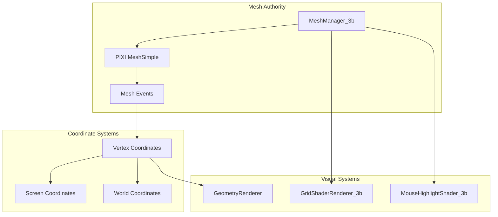

### Mesh Generation Process

```typescript
// MeshManager_3b.ts - Authoritative mesh creation
private generateMesh(): void {
  const screenWidth = window.innerWidth
  const screenHeight = window.innerHeight
  const cellSize = this.cellSize
  const gridWidth = Math.ceil(screenWidth / cellSize)
  const gridHeight = Math.ceil(screenHeight / cellSize)
  
  const vertices: number[] = []
  const indices: number[] = []
  
  let vertexIndex = 0
  for (let x = 0; x < gridWidth; x++) {
    for (let y = 0; y < gridHeight; y++) {
      const screenX = x * cellSize
      const screenY = y * cellSize
      
      // Create quad vertices for each cell
      vertices.push(
        screenX, screenY,                              // top-left
        screenX + cellSize, screenY,                   // top-right
        screenX + cellSize, screenY + cellSize,        // bottom-right
        screenX, screenY + cellSize                    // bottom-left
      )
      
      // Create triangle indices for the quad
      const base = vertexIndex * 4
      indices.push(
        base + 0, base + 1, base + 2,  // First triangle
        base + 0, base + 2, base + 3   // Second triangle
      )
      
      vertexIndex++
    }
  }
  
  this.vertices = new Float32Array(vertices)
  this.indices = new Uint32Array(indices)
  
  // Create PIXI mesh
  this.mesh = new MeshSimple({
    texture: Texture.WHITE,
    vertices: this.vertices,
    indices: this.indices
  })
}
```

### Coordinate Transformation System

```mermaid
graph LR
    subgraph "Transformation Flow"
        MeshEvent[Mesh Event] --> LocalPos[Local Position]
        LocalPos --> VertexCoord[Vertex Coordinate]
        VertexCoord --> ScreenCoord[Screen Coordinate]
        VertexCoord --> WorldCoord[World Coordinate]
    end
    
    subgraph "Formulas"
        F1[vertex = floor(local / cellSize)]
        F2[screen = vertex * cellSize]
        F3[world = vertex + navigation.offset]
    end
    
    LocalPos -.-> F1
    VertexCoord -.-> F2
    VertexCoord -.-> F3
```

### Mesh System Components

#### 1. MeshManager_3b - Mesh Authority
- Generates mesh geometry based on screen size and cell size
- Provides authoritative coordinate transformations
- Manages mesh lifecycle

#### 2. GridShaderRenderer_3b - Visual Rendering
- Applies checkboard shader to mesh
- Toggleable via store state
- Uses vertex shaders for grid pattern

#### 3. MouseHighlightShader_3b - Mouse Feedback
- Sprite-based highlighting system
- Direct positioning from mesh coordinates
- GPU-accelerated color matrix filters

---

## Component Interaction Patterns

### Game Initialization Flow

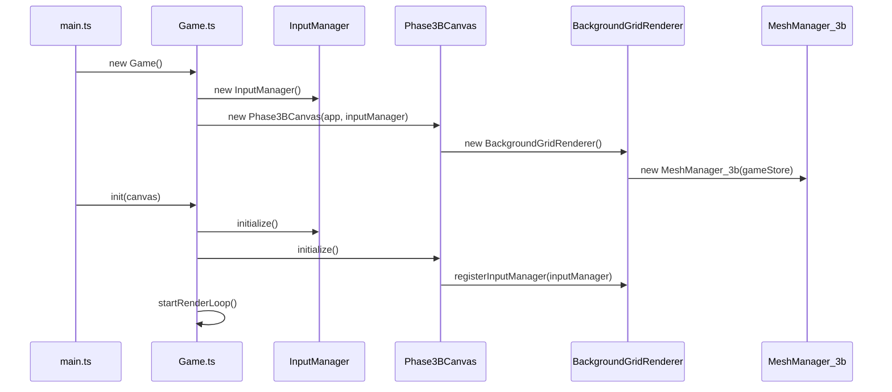

### Object Creation Interaction

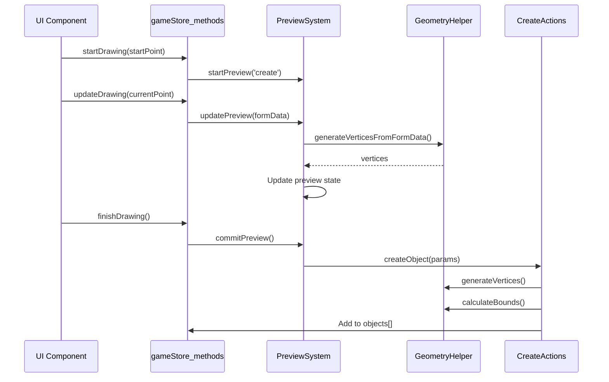

### Input Event Flow

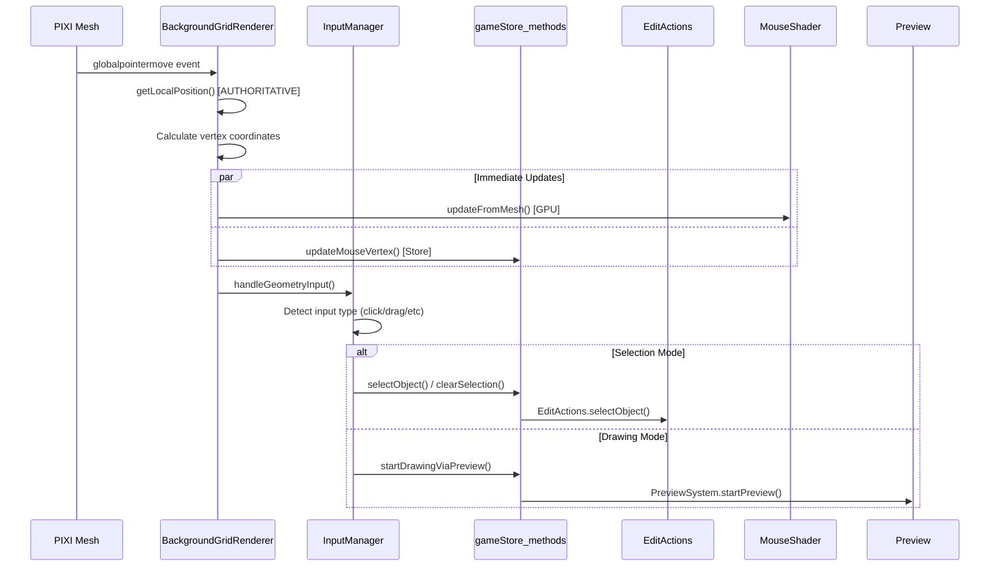

---

## Circle Bug Prevention Analysis

### The Problem

The "circle bug" occurs when there are **circular dependencies** in property calculations:

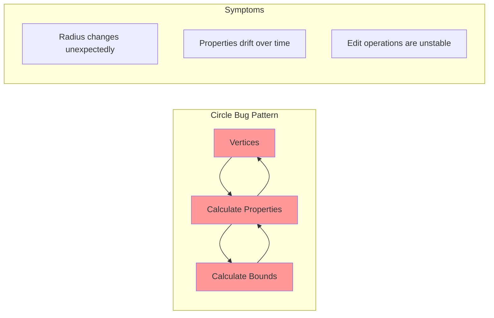

### The Solution

Phase 3B prevents this through **strict forward-only calculations**:

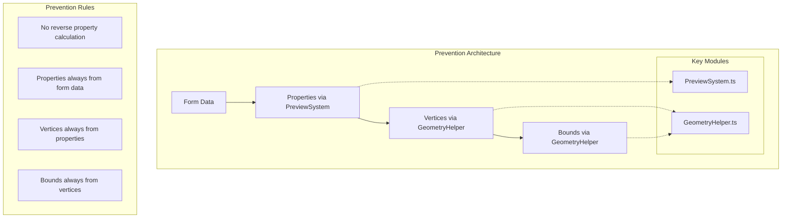

### Implementation Details

#### 1. PreviewSystem - Form Data Authority
```typescript
// PreviewSystem.ts - Form data is authoritative
generatePropertiesFromFormData(formData: ObjectEditFormData): any {
  if (formData.circle) {
    const radius = formData.circle.radius  // DIRECT from form
    return {
      type: 'circle',
      center: { x: formData.circle.centerX, y: formData.circle.centerY },
      radius: radius,  // NO REVERSE ENGINEERING
      diameter: radius * 2,
      circumference: 2 * Math.PI * radius,
      area: Math.PI * radius * radius
    }
  }
}
```

#### 2. GeometryHelper - Forward-Only Generation
```typescript
// GeometryHelper.ts - Vertices from properties only
static generateVertices(type: string, properties: any): PixeloidCoordinate[] {
  switch (type) {
    case 'circle':
      return this.generateCircleVertices(properties.center, properties.radius)
    // ... other types
  }
}

private static generateCircleVertices(center: PixeloidCoordinate, radius: number): PixeloidCoordinate[] {
  const segments = 32
  const vertices: PixeloidCoordinate[] = []
  
  for (let i = 0; i < segments; i++) {
    const angle = (i / segments) * 2 * Math.PI
    vertices.push({
      x: center.x + Math.cos(angle) * radius,
      y: center.y + Math.sin(angle) * radius
    })
  }
  
  return vertices
}
```

#### 3. Creation Flow - No Circular Dependencies
```typescript
// CreateActions.ts - Clean creation path
createObject(store: GameStoreData, params: CreateObjectParams): string {
  // 1. Generate vertices from properties (forward only)
  const vertices = params.vertices || GeometryHelper.generateVertices(params.type, params.properties)
  
  // 2. Calculate bounds from vertices (forward only)  
  const bounds = GeometryHelper.calculateBounds(vertices)
  
  // 3. Calculate properties from vertices if needed (forward only)
  const properties = params.properties || GeometryHelper.calculateProperties(params.type, vertices)
  
  // 4. Create object - no circular calculations
  const newObject: GeometricObject = {
    // ... object creation
    vertices,
    bounds, 
    properties
  }
  
  store.objects.push(newObject)
  return newObject.id
}
```

---

## Data Flow Analysis

### Complete System Data Flow

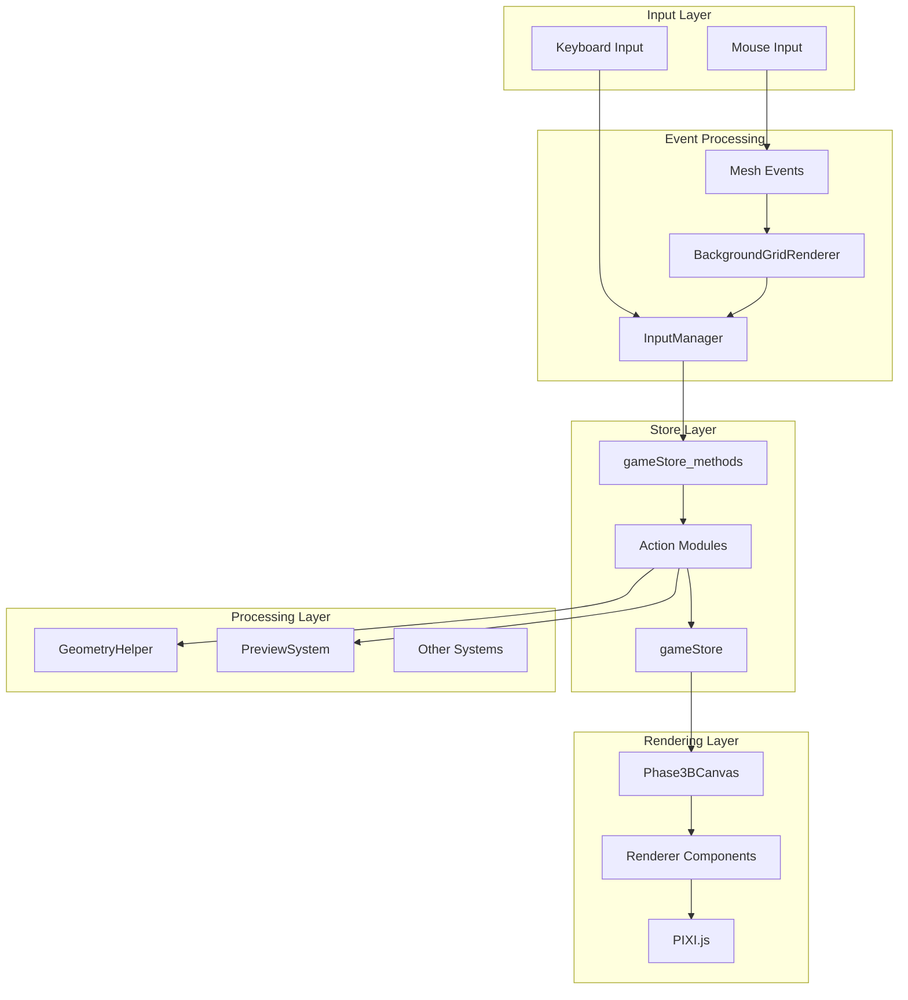

### State Update Patterns

#### 1. Object Creation State Flow
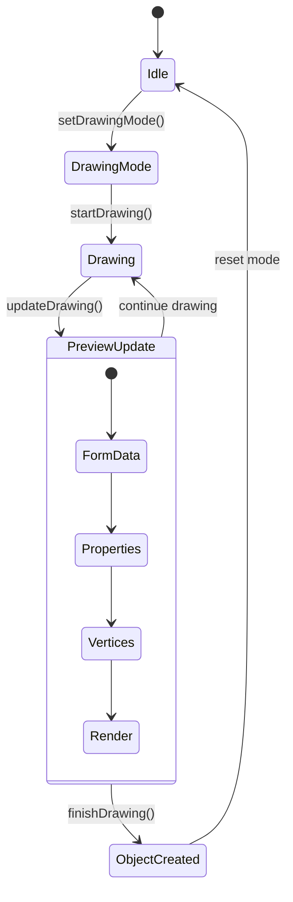

#### 2. Selection State Flow
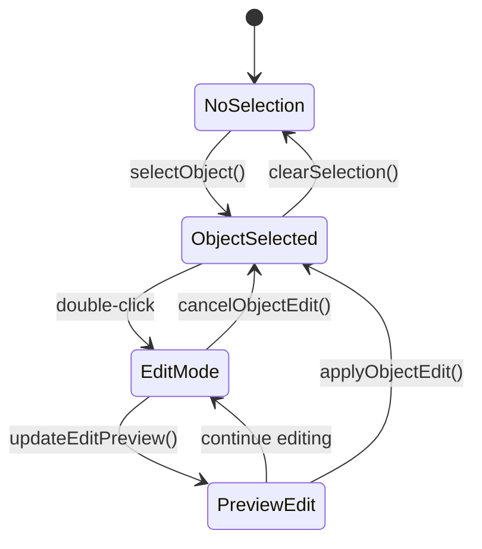

### Critical Data Paths

#### 1. Mouse Position Synchronization
```typescript
// Critical path: Mesh events → Store → UI updates
mesh.on('globalpointermove', (event) => {
  // 1. Get authoritative position
  const localPos = event.getLocalPosition(mesh)
  const vertexCoord = { x: Math.floor(localPos.x), y: Math.floor(localPos.y) }
  
  // 2. Immediate dual updates (no delays)
  mouseHighlightShader.updateFromMesh(vertexCoord)      // GPU update
  gameStore_methods.updateMouseVertex(vertexCoord.x, vertexCoord.y)  // Store update
  
  // 3. Route to input processing
  this.handleGeometryInput('move', vertexCoord, event)
})
```

#### 2. Object State Synchronization
```typescript
// Critical path: Store updates → Reactive rendering
// Store update triggers reactive update in components
store.objects.push(newObject)  // Valtio proxy triggers updates

// Components subscribe to store changes
subscribe(gameStore.objects, () => {
  this.updateObjectRendering()  // Automatic re-render
})
```

---

## Conclusions

### Architecture Strengths

1. **Clean Separation of Concerns**: Each module has a single, well-defined responsibility
2. **Circle Bug Prevention**: Forward-only calculations prevent property calculation loops
3. **Mesh-First Design**: Authoritative coordinate source eliminates coordinate confusion
4. **Modular Action System**: Store methods dispatch to specialized action modules
5. **Type Safety**: Comprehensive type system prevents runtime errors
6. **Reactive Updates**: Valtio proxy system provides efficient reactive updates

### Critical Success Factors

1. **GeometryHelper.ts**: Central module that provides consistent geometry calculations
2. **PreviewSystem.ts**: Ensures preview operations use same calculation paths as creation
3. **InputManager.ts**: Safe input detection with proper mode routing
4. **BackgroundGridRenderer.ts**: Mesh-first coordinate authority
5. **Action Modules**: Clean separation between creation and editing operations

### Performance Characteristics

1. **Immediate GPU Updates**: Mouse highlighting has no lag due to direct GPU updates
2. **Efficient Hit Testing**: Cached hit testing with configurable timeout
3. **Reactive Store Updates**: Only components that need updates are re-rendered
4. **Forward-Only Calculations**: No circular dependencies means predictable performance

### Extensibility Points

1. **Action Modules**: Easy to add new action types (CreateActions, EditActions, etc.)
2. **System Modules**: Easy to add new systems (PreviewSystem, ValidationSystem, etc.)
3. **Geometry Types**: GeometryHelper can be extended with new shape types
4. **Input Modes**: InputManager can handle new interaction modes
5. **Renderer Components**: Phase3BCanvas can integrate new rendering components

This architecture provides a solid foundation for building complex geometry editing applications with reliable, predictable behavior and excellent performance characteristics.