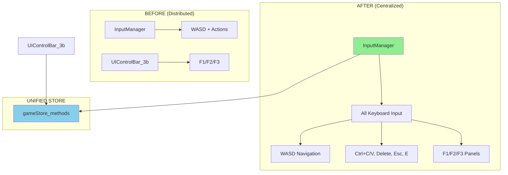

# Step 0 Implementation Guide: Keyboard Handling Centralization

## Overview
Move F1/F2/F3 keyboard shortcuts from UIControlBar_3b.ts to InputManager.ts and fix the broken store imports.

## Part 1: Add Panel Shortcuts to InputManager

### File: `app/src/game/InputManager.ts`

**Location:** Line 650-670 in `KeyboardHandler.handleKeyDown()` method

**Add this code block after the existing action shortcuts (around line 650):**

```typescript
// Panel shortcuts (moved from UIControlBar_3b)
if (!event.ctrlKey && !event.metaKey) {
  switch (key) {
    case 'f1':
      gameStore_methods.toggleStorePanel()
      event.preventDefault()
      break
    case 'f2':
      gameStore_methods.toggleLayerToggle()
      event.preventDefault()
      break
    case 'f3':
      gameStore_methods.toggleGeometryPanel()
      event.preventDefault()
      break
  }
}
```

**Context - Insert between these existing sections:**
```typescript
// Action shortcuts
if (event.ctrlKey || event.metaKey) {
  switch (key) {
    case 'c':
      this.handleCopy()
      event.preventDefault()
      break
    case 'v':
      this.handlePaste()
      event.preventDefault()
      break
  }
}

// ✅ INSERT NEW PANEL SHORTCUTS HERE

// Direct action keys
switch (key) {
  case 'delete':
  // ... existing code
```

## Part 2: Fix UIControlBar_3b Store Import

### File: `app/src/ui/UIControlBar_3b.ts`

#### 2.1 Update Import Statement (Line 4)
**CHANGE:**
```typescript
import { gameStore_3b, gameStore_3b_methods } from '../store/gameStore_3b'
```

**TO:**
```typescript
import { gameStore, gameStore_methods } from '../store/game-store'
```

#### 2.2 Update All Store References

**Find and replace ALL instances:**

| Old Reference | New Reference | Count |
|---------------|---------------|-------|
| `gameStore_3b_methods.toggleStorePanel()` | `gameStore_methods.toggleStorePanel()` | 1 |
| `gameStore_3b_methods.toggleGeometryPanel()` | `gameStore_methods.toggleGeometryPanel()` | 1 |
| `gameStore_3b_methods.toggleLayerToggle()` | `gameStore_methods.toggleLayerToggle()` | 1 |
| `gameStore_3b.ui.showStorePanel` | `gameStore.ui.showStorePanel` | 2 |
| `gameStore_3b.ui.showGeometryPanel` | `gameStore.ui.showGeometryPanel` | 2 |
| `gameStore_3b.ui.showLayerToggle` | `gameStore.ui.showLayerToggle` | 2 |
| `gameStore_3b.selection` | `gameStore.selection` | 1 |
| `gameStore_3b.selection.selectedObjectId` | `gameStore.selection.selectedId` | 2 |

**Important:** Note the field name change: `selectedObjectId` → `selectedId`

#### 2.3 Remove Keyboard Handling (Lines 65-83)

**DELETE this entire method:**
```typescript
/**
 * Setup keyboard shortcuts for Phase 3B
 */
private setupKeyboardShortcuts(): void {
  document.addEventListener('keydown', (event) => {
    if (event.key === 'F1') {
      this.toggleStorePanel()
      event.preventDefault()
    }
    if (event.key === 'F2') {
      this.toggleLayerBar()
      event.preventDefault()
    }
    if (event.key === 'F3') {
      this.toggleGeometryPanel()
      event.preventDefault()
    }
  })
}
```

#### 2.4 Remove Keyboard Setup Call (Line 25)

**In constructor, CHANGE:**
```typescript
constructor() {
  this.setupEventListeners()
  this.setupKeyboardShortcuts()  // ❌ DELETE this line
  this.setupSelectionSubscription()
  console.log('UIControlBar_3b: Initialized Phase 3A control bar')
}
```

**TO:**
```typescript
constructor() {
  this.setupEventListeners()
  this.setupSelectionSubscription()
  console.log('UIControlBar_3b: Initialized Phase 3A control bar')
}
```

## Part 3: Verification Checklist

### ✅ InputManager Changes
- [ ] Added F1/F2/F3 shortcuts to KeyboardHandler.handleKeyDown()
- [ ] Panel shortcuts use existing gameStore_methods
- [ ] Event.preventDefault() called for each shortcut

### ✅ UIControlBar_3b Changes  
- [ ] Import changed to new unified store
- [ ] All `gameStore_3b` → `gameStore`
- [ ] All `gameStore_3b_methods` → `gameStore_methods`
- [ ] `selectedObjectId` → `selectedId` (field name fix)
- [ ] `setupKeyboardShortcuts()` method deleted
- [ ] Keyboard setup call removed from constructor

### ✅ Expected Behavior
- [ ] F1 still toggles Store Panel
- [ ] F2 still toggles Layer Toggle Bar  
- [ ] F3 still toggles Geometry Panel
- [ ] All existing WASD/Copy/Paste/Delete shortcuts still work
- [ ] UI buttons still work (click handlers preserved)
- [ ] Selection subscription still works with new store

## Part 4: Testing Commands

After implementation, test these keyboard shortcuts:

```bash
# Navigation (should still work)
W/A/S/D - Navigate view
Space - Reset navigation

# Actions (should still work) 
Ctrl+C - Copy selected object
Ctrl+V - Paste object
Delete - Delete selected object
Escape - Cancel operations
E - Edit selected object

# Panel toggles (moved to InputManager)
F1 - Toggle Store Panel
F2 - Toggle Layer Controls  
F3 - Toggle Geometry Panel
```

## Part 5: Architecture Benefits

This change creates **single input authority** as documented in the Phase 3B architecture:



### Benefits:
1. **Single Input Authority** - All keyboard input handled in one place
2. **Consistent Event Handling** - Same preventDefault() and error handling
3. **Clean UI Components** - UIControlBar focuses on UI state, not input
4. **Unified Store Integration** - All components use same store methods
5. **Easier Debugging** - One place to check all keyboard shortcuts

## Part 6: File Summary

| File | Status | Changes |
|------|--------|---------|
| `app/src/game/InputManager.ts` | ✅ Ready | Add F1/F2/F3 shortcuts to KeyboardHandler |
| `app/src/ui/UIControlBar_3b.ts` | ❌ Broken Import | Fix import + remove keyboard handling |
| `app/src/store/game-store.ts` | ✅ Ready | All required methods exist |

The new unified store already has all required methods - this is just about centralizing keyboard input and fixing broken imports.