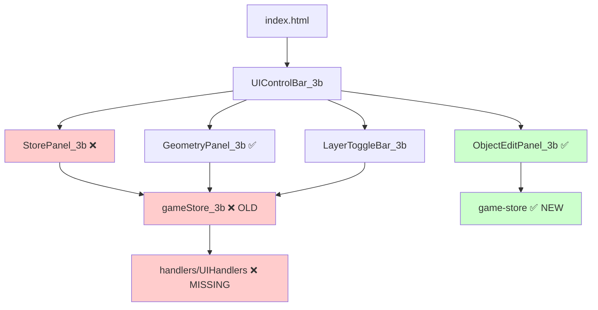

# UI Component Analysis - Phase 3B Architecture

## Overview

Analysis of all UI components in the Phase 3B system, documenting functionality, dependencies, and architecture issues discovered during migration assessment.

## File Analysis

### 1. `app/src/ui/StorePanel_3b.ts.old`

**Status**: ❌ **LEGACY FILE - USES OLD STORE**

**Purpose**: Comprehensive debug and monitoring panel for Phase 3B foundation systems

**Dependencies**:
- `gameStore_3b, gameStore_3b_methods` from `../store/gameStore_3b` ❌ OLD STORE
- `UIHandlers` from `./handlers/UIHandlers` ❌ MISSING DIRECTORY
- Uses helper functions: `updateElement`, `getBooleanStatusClass`, `getBooleanStatusText`, `STATUS_COLORS`

**Functionality**:
- **Element Management**: Maps 77+ DOM element IDs for real-time updates
- **Mouse Tracking**: Displays vertex, screen, and world coordinates
- **Navigation**: Shows offset, dragging state, move amount
- **Mesh System**: Cell size, dimensions, vertex count, update status
- **Layer Controls**: Grid, mouse, geometry, checkboard visibility states
- **Geometry System**: Object count, drawing mode, preview status
- **Selected Object Testing**: Detailed coordinate transformations and style info
- **Drag State Testing**: Complete drag system debugging info
- **Reactive Updates**: Fine-grained subscriptions to store slices

**Architecture Pattern**:
```typescript
// Element mapping system
private elements: Map<string, HTMLElement> = new Map()

// Reactive subscriptions
subscribe(gameStore_3b.mouse, () => this.updateMouseValues())
subscribe(gameStore_3b.navigation, () => this.updateNavigationValues())
// ... etc
```

**HTML Dependencies**: Expects 77+ specific element IDs in `index.html`

---

### 2. `app/src/ui/UIControlBar_3b.ts`

**Status**: ❌ **IMPORT MISMATCH - REFERENCES MISSING FILE**

**Purpose**: Central UI coordinator for panel management and keyboard shortcuts

**Dependencies**:
- `StorePanel_3b` from `./StorePanel_3b` ❌ FILE DOESN'T EXIST (only .old exists)
- `GeometryPanel_3b` from `./GeometryPanel_3b` ✅ EXISTS
- `ObjectEditPanel_3b` from `./ObjectEditPanel_3b` ✅ EXISTS
- `gameStore_3b, gameStore_3b_methods` from `../store/gameStore_3b` ❌ OLD STORE

**Functionality**:
- **Panel Coordination**: Manages visibility of 3 main panels
- **Keyboard Shortcuts**: F1 (store), F2 (layers), F3 (geometry)
- **Button State Management**: Visual feedback for active/inactive panels
- **Selection Management**: Creates/destroys ObjectEditPanel_3b on selection changes
- **Registration System**: Panels register themselves with the control bar

**Critical Issue**:
```typescript
import { StorePanel_3b } from './StorePanel_3b'  // ❌ FILE MISSING
```

**HTML Dependencies**: 
- `#toggle-geometry-panel`
- `#toggle-store-panel` 
- `#toggle-layers`

---

### 3. `app/src/ui/LayerToggleBar_3b.ts`

**Status**: ❌ **USES OLD STORE**

**Purpose**: Reactive layer visibility controls for Phase 3B rendering

**Dependencies**:
- `subscribeKey` from `valtio/utils` ✅ EXTERNAL
- `gameStore_3b, gameStore_3b_methods` from `../store/gameStore_3b` ❌ OLD STORE

**Functionality**:
- **Layer Management**: Mouse, checkboard, geometry visibility
- **Fine-grained Reactivity**: Uses `subscribeKey` for precise subscriptions
- **Custom Events**: Dispatches `phase3b-layer-changed` events
- **Button State Sync**: Automatic visual state updates
- **Memory Management**: Proper subscription cleanup

**Architecture Pattern**:
```typescript
// Fine-grained subscriptions
this.unsubscribers.push(
  subscribeKey(gameStore_3b.ui, 'showMouse', () => {
    this.updateMouseButtonState()
  })
)

// Custom event dispatch
const event = new CustomEvent('phase3b-layer-changed', {
  detail: { layer: 'mouse', visible: gameStore_3b.ui.showMouse }
})
document.dispatchEvent(event)
```

**HTML Dependencies**:
- `#layer-toggle-bar`
- `#toggle-layer-mouse`
- `#toggle-checkboard`
- `#toggle-geometry`

---

### 4. `app/src/ui/ObjectEditPanel_3b.ts`

**Status**: ✅ **CORRECTLY MIGRATED TO NEW STORE**

**Purpose**: Object property editing with live preview (Circle bug fix implementation)

**Dependencies**:
- `gameStore, gameStore_methods` from `../store/game-store` ✅ NEW UNIFIED STORE
- `GeometricObject, ObjectEditFormData` from `../types` ✅ CORRECT TYPES

**Functionality**:
- **Dynamic Form Generation**: Creates edit forms based on object type
- **Live Preview**: Real-time updates via `gameStore_methods.updatePreview()`
- **Circle Bug Prevention**: Uses direct form data instead of vertex reverse-engineering
- **Type-safe Property Editing**: Handles point, line, circle, rectangle shapes
- **Style Management**: Stroke/fill color, width, alpha controls
- **Preview System Integration**: Connects to unified store preview system

**Critical Architecture**:
```typescript
// ✅ CIRCLE BUG FIX: Direct form data usage
private handleFormInput(): void {
  const formData = this.getFormData()
  gameStore_methods.updatePreview({
    operation: 'move',
    formData: formData  // Direct form data - radius stays exactly as typed
  })
}
```

**HTML Dependencies**: Creates its own HTML dynamically

---

### 5. `app/index.html`

**Status**: ✅ **COMPREHENSIVE UI STRUCTURE**

**Purpose**: Complete HTML foundation for Phase 3B UI system

**Structure**:
```html
<!-- Main Canvas -->
<canvas id="gameCanvas"></canvas>

<!-- UI Control Bar (Top Center) -->
<div id="ui-control-bar">
  <button id="toggle-geometry-panel">Geometry</button>
  <button id="toggle-layers">Layers</button>
  <button id="toggle-store-panel">Store</button>
</div>

<!-- Store Panel (Top Right) - 77+ Element IDs -->
<div id="store-panel">
  <!-- Phase 3B Status Section -->
  <span id="game-initialized"></span>
  <span id="mesh-scale"></span>
  <span id="layers-active"></span>
  
  <!-- Mouse Position Section -->
  <span id="mouse-vertex"></span>
  <span id="mouse-screen"></span>
  <span id="mouse-world"></span>
  
  <!-- Navigation Section -->
  <span id="navigation-offset"></span>
  <span id="navigation-dragging"></span>
  <span id="navigation-move-amount"></span>
  
  <!-- Mesh System Section -->
  <span id="mesh-ready"></span>
  <span id="mesh-cell-size"></span>
  <span id="mesh-dimensions"></span>
  <span id="mesh-vertex-count"></span>
  <span id="mesh-needs-update"></span>
  
  <!-- Layer Controls Section -->
  <span id="layer-grid-status"></span>
  <span id="layer-geometry-status"></span>
  <span id="layer-mouse-status"></span>
  <span id="checkboard-enabled"></span>
  
  <!-- Mouse Highlight Section -->
  <span id="mouse-highlight-color"></span>
  <span id="mouse-highlight-intensity"></span>
  
  <!-- Geometry System Section -->
  <span id="geometry-objects-count"></span>
  <span id="geometry-drawing-mode"></span>
  <span id="geometry-is-drawing"></span>
  <span id="geometry-preview-active"></span>
  
  <!-- Selected Object Testing Section -->
  <span id="selected-object-id"></span>
  <span id="selected-object-type"></span>
  <span id="selected-object-pixeloid-x"></span>
  <span id="selected-object-pixeloid-y"></span>
  <span id="selected-object-vertex-x"></span>
  <span id="selected-object-vertex-y"></span>
  <span id="selected-object-screen-x"></span>
  <span id="selected-object-screen-y"></span>
  <span id="selected-object-style-color"></span>
  <span id="selected-object-style-stroke-width"></span>
  <span id="selected-object-dragging-state"></span>
  
  <!-- Drag State Testing Section -->
  <span id="drag-state-is-dragging"></span>
  <span id="drag-state-object-id"></span>
  <span id="drag-state-click-position"></span>
  <span id="drag-state-vertex-offsets-count"></span>
  <span id="drag-preview-is-active"></span>
  <span id="drag-preview-mouse-position"></span>
  <span id="drag-preview-vertices-count"></span>
</div>

<!-- Geometry Panel (Left Side) -->
<div id="geometry-panel">
  <!-- Drawing Mode Buttons -->
  <button id="geometry-mode-none"></button>
  <button id="geometry-mode-point"></button>
  <button id="geometry-mode-line"></button>
  <button id="geometry-mode-circle"></button>
  <button id="geometry-mode-rectangle"></button>
  <button id="geometry-mode-diamond"></button>
  
  <!-- Current State Display -->
  <span id="geometry-current-mode"></span>
  <span id="geometry-objects-count"></span>
  <span id="geometry-selected-count"></span>
  
  <!-- Drawing Settings -->
  <input id="geometry-default-color" type="color">
  <input id="geometry-default-stroke-width" type="number">
  <input id="geometry-default-fill-color" type="color">
  <input id="geometry-fill-enabled" type="checkbox">
  <input id="geometry-fill-alpha" type="range">
  <span id="geometry-fill-alpha-value"></span>
  <input id="geometry-stroke-alpha" type="range">
  <span id="geometry-stroke-alpha-value"></span>
  
  <!-- Drawing Options -->
  <input id="drawing-preview-opacity" type="range">
  <span id="drawing-preview-opacity-value"></span>
  
  <!-- Action Buttons -->
  <button id="geometry-clear-all"></button>
  <button id="geometry-reset-styles"></button>
</div>

<!-- Layer Toggle Bar (Bottom Right) -->
<div id="layer-toggle-bar">
  <button id="toggle-layer-mouse"></button>
  <button id="toggle-geometry"></button>
  <button id="toggle-checkboard"></button>
</div>

<!-- Object Edit Panel (Center Overlay) -->
<div id="object-edit-panel">
  <!-- Dynamic content created by ObjectEditPanel_3b -->
  <div id="object-edit-panel-content"></div>
  <button id="edit-panel-apply"></button>
  <button id="edit-panel-cancel"></button>
  <button id="edit-panel-close"></button>
</div>
```

## Architecture Issues Discovered

### 1. Store Architecture Fragmentation
- **StorePanel_3b.ts.old**: Uses `gameStore_3b` (OLD)
- **UIControlBar_3b.ts**: Uses `gameStore_3b` (OLD)  
- **LayerToggleBar_3b.ts**: Uses `gameStore_3b` (OLD)
- **ObjectEditPanel_3b.ts**: Uses `game-store` (NEW) ✅

### 2. Missing File References
- **UIControlBar_3b.ts** imports `StorePanel_3b` but only `StorePanel_3b.ts.old` exists
- **StorePanel_3b.ts.old** imports from `./handlers/UIHandlers` (directory doesn't exist)

### 3. Export/Import Mismatches in index.ts
```typescript
// Current exports that may not exist:
export { StorePanel_3b } from './StorePanel_3b';        // ❌ MISSING
export { StoreExplorer } from './StoreExplorer';        // ❌ NOT IN /ui/
export { ECSDataLayerPanel } from './ECSDataLayerPanel'; // ❌ NOT IN /ui/
export { ECSMirrorLayerPanel } from './ECSMirrorLayerPanel'; // ❌ NOT IN /ui/
```

### 4. Dependencies on Missing Helpers
**StorePanel_3b.ts.old** requires:
- `updateElement(elements, id, content, className)`
- `getBooleanStatusClass(boolean)` 
- `getBooleanStatusText(boolean)`
- `STATUS_COLORS` constants

## Data Flow Architecture



## Migration Requirements

### Phase 1: Fix Critical Import Issues
1. **Create missing `StorePanel.ts`** using NEW unified store
2. **Remove missing exports** from `index.ts`
3. **Create missing `UIHandlers`** helpers

### Phase 2: Store Migration
1. **Migrate UIControlBar_3b.ts** to use `game-store`
2. **Migrate LayerToggleBar_3b.ts** to use `game-store`  
3. **Verify ObjectEditPanel_3b.ts** integration

### Phase 3: Functionality Preservation
1. **Preserve all 77+ element updates** from StorePanel_3b.ts.old
2. **Maintain reactive subscriptions** with new store
3. **Keep keyboard shortcuts** and panel coordination
4. **Preserve layer toggle events** and visual states

## UI Component Responsibilities

| Component | Responsibility | Store Used | Status |
|-----------|----------------|------------|---------|
| **UIControlBar_3b** | Panel coordination, shortcuts | OLD | ❌ Needs migration |
| **StorePanel** | Debug monitoring, state display | MISSING | ❌ Needs creation |
| **GeometryPanel_3b** | Drawing tools, style controls | OLD | ❌ Needs migration |
| **LayerToggleBar_3b** | Layer visibility controls | OLD | ❌ Needs migration |
| **ObjectEditPanel_3b** | Object property editing | NEW | ✅ Correctly migrated |

## Critical Functionality to Preserve

### From StorePanel_3b.ts.old:
- **77+ element real-time updates** for comprehensive debugging
- **Mouse coordinate tracking** (vertex, screen, world)
- **Navigation state monitoring** (offset, dragging, move amount)
- **Mesh system status** (ready, cell size, dimensions, vertex count)
- **Layer control states** (grid, mouse, geometry, checkboard)
- **Geometry system monitoring** (objects, drawing mode, preview)
- **Selected object debugging** (coordinates, style, drag state)
- **Drag system debugging** (state, offsets, preview)

### From Other Components:
- **Keyboard shortcuts** (F1, F2, F3)
- **Panel coordination** and registration system
- **Button state synchronization**
- **Layer toggle events** with custom event dispatch
- **Live preview system** for object editing
- **Circle bug prevention** through direct form data usage

## Next Steps

1. **Create new `StorePanel.ts`** migrating ALL functionality from `.old` file
2. **Update UIControlBar_3b.ts** import to use new `StorePanel`
3. **Create missing `UIHandlers`** helper functions
4. **Migrate remaining components** to unified store
5. **Update `index.ts`** exports to match actual files
6. **Test complete UI integration** with new store architecture