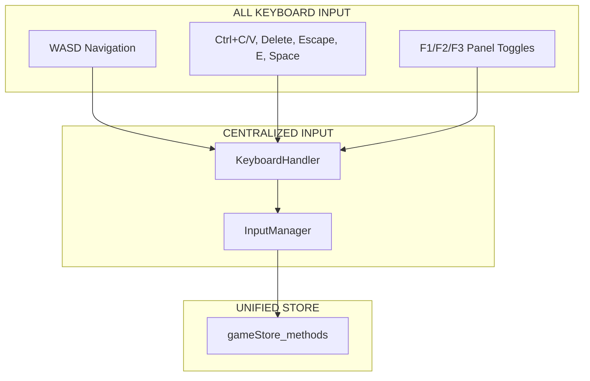

# UI Migration to New Store Plan - Complete Integration Guide

## Current State Analysis

### ✅ NEW UNIFIED STORE IS READY
The new store at `/app/src/store/game-store.ts` is complete with:
- `gameStore` (proxy state with all _3b properties)
- `gameStore_methods` (all required methods for UI integration)

### ❌ OLD UI COMPONENTS USING WRONG STORE
Old UI components are importing from non-existent `gameStore_3b`:
```typescript
// UIControlBar_3b.ts - WRONG
import { gameStore_3b, gameStore_3b_methods } from '../store/gameStore_3b'

// LayerToggleBar_3b.ts - WRONG  
import { gameStore_3b, gameStore_3b_methods } from '../store/gameStore_3b'

// StorePanel_3b.ts.old - WRONG
import { gameStore_3b, gameStore_3b_methods } from '../store/gameStore_3b'
```

## Migration Strategy

### Phase 1: Fix Import References

#### 1.1 UIControlBar_3b.ts Migration
**Current (BROKEN):**
```typescript
import { gameStore_3b, gameStore_3b_methods } from '../store/gameStore_3b'

// Usage:
gameStore_3b_methods.toggleStorePanel()
gameStore_3b.ui.showStorePanel
gameStore_3b.selection.selectedObjectId
```

**Fixed:**
```typescript
import { gameStore, gameStore_methods } from '../store/game-store'

// Usage (exact same methods exist):
gameStore_methods.toggleStorePanel()          // ✅ EXISTS
gameStore.ui.showStorePanel                   // ✅ EXISTS  
gameStore.selection.selectedId                // ✅ EXISTS (note: selectedId not selectedObjectId)
```

#### 1.2 LayerToggleBar_3b.ts Migration
**Current (BROKEN):**
```typescript
import { gameStore_3b, gameStore_3b_methods } from '../store/gameStore_3b'

// Usage:
gameStore_3b_methods.toggleMouse()
gameStore_3b_methods.toggleCheckboard()
gameStore_3b_methods.toggleGeometry()
gameStore_3b.ui.showMouse
```

**Fixed:**
```typescript
import { gameStore, gameStore_methods } from '../store/game-store'

// Usage (exact same methods exist):
gameStore_methods.toggleMouse()               // ✅ EXISTS
gameStore_methods.toggleCheckboard()          // ✅ EXISTS  
gameStore_methods.toggleGeometry()            // ✅ EXISTS
gameStore.ui.showMouse                        // ✅ EXISTS
```

#### 1.3 StorePanel Creation (from .old)
**New StorePanel_3b.ts:**
```typescript
import { gameStore, gameStore_methods } from '../store/game-store'
import { subscribe } from 'valtio'

export class StorePanel_3b {
  // All the same functionality as .old but with NEW store
  private updateMouseValues(): void {
    // OLD: gameStore_3b.mouse.vertex
    // NEW: gameStore.mouse.vertex ✅ EXISTS
    updateElement(this.elements, 'mouse-vertex', 
      `(${gameStore.mouse.vertex.x}, ${gameStore.mouse.vertex.y})`)
  }
  
  private updateNavigationValues(): void {
    // OLD: gameStore_3b.navigation.offset
    // NEW: gameStore.navigation.offset ✅ EXISTS
    updateElement(this.elements, 'navigation-offset',
      `(${gameStore.navigation.offset.x}, ${gameStore.navigation.offset.y})`)
  }
  
  // ... all other methods with same pattern
}
```

### Phase 2: Keyboard Handling Centralization ✅ **RECOMMENDED**

You're absolutely right - keyboard handling should be in InputManager. Current setup:

**InputManager.ts KeyboardHandler already handles:**
- ✅ WASD navigation
- ✅ Ctrl+C/V copy/paste  
- ✅ Delete/Backspace
- ✅ Escape
- ✅ E (edit)
- ✅ Space (reset navigation)

**Add F1/F2/F3 panel shortcuts to InputManager:**
```typescript
// app/src/game/InputManager.ts → KeyboardHandler.handleKeyDown()
private handleKeyDown(event: KeyboardEvent): void {
  const key = event.key.toLowerCase()
  
  // ✅ EXISTING: Navigation shortcuts...
  // ✅ EXISTING: Action shortcuts...
  
  // ✅ NEW: Panel shortcuts (move from UIControlBar_3b)
  if (!event.ctrlKey && !event.metaKey) {
    switch (key) {
      case 'f1':
        gameStore_methods.toggleStorePanel()     // ✅ EXISTS
        event.preventDefault()
        break
      case 'f2':  
        gameStore_methods.toggleLayerToggle()    // ✅ EXISTS
        event.preventDefault()
        break
      case 'f3':
        gameStore_methods.toggleGeometryPanel()  // ✅ EXISTS
        event.preventDefault()
        break
    }
  }
  
  // ✅ EXISTING: Direct action keys...
}
```

**Remove keyboard handling from UIControlBar_3b:**
```typescript
// DELETE this method entirely:
private setupKeyboardShortcuts(): void {
  // DELETE - moved to InputManager
}
```

### Phase 3: Create Missing Helper Files

#### 3.1 Create UIHandlers.ts 
Based on usage in StorePanel_3b.ts.old, create:
```typescript
// app/src/ui/helpers/UIHandlers.ts
export function updateElement(
  elements: Map<string, HTMLElement>, 
  id: string, 
  content: string, 
  className?: string
): void {
  const element = elements.get(id)
  if (element) {
    element.textContent = content
    if (className) {
      element.className = className
    }
  }
}

export function getBooleanStatusClass(value: boolean): string {
  return value ? 'status-active' : 'status-inactive'
}

export function getBooleanStatusText(value: boolean): string {
  return value ? 'ON' : 'OFF'
}

export const STATUS_COLORS = {
  active: '#4ade80',      // green-400
  inactive: '#6b7280',    // gray-500  
  error: '#ef4444',       // red-500
  warning: '#f59e0b'      // amber-500
}
```

## Exact Method Mapping

### All Required Methods Already Exist in New Store:

| Old Usage | New Usage | Status |
|-----------|-----------|---------|
| `gameStore_3b_methods.toggleStorePanel()` | `gameStore_methods.toggleStorePanel()` | ✅ EXISTS |
| `gameStore_3b_methods.toggleGeometryPanel()` | `gameStore_methods.toggleGeometryPanel()` | ✅ EXISTS |
| `gameStore_3b_methods.toggleLayerToggle()` | `gameStore_methods.toggleLayerToggle()` | ✅ EXISTS |
| `gameStore_3b_methods.toggleMouse()` | `gameStore_methods.toggleMouse()` | ✅ EXISTS |
| `gameStore_3b_methods.toggleCheckboard()` | `gameStore_methods.toggleCheckboard()` | ✅ EXISTS |
| `gameStore_3b_methods.toggleGeometry()` | `gameStore_methods.toggleGeometry()` | ✅ EXISTS |
| `gameStore_3b_methods.updateMouseVertex()` | `gameStore_methods.updateMouseVertex()` | ✅ EXISTS |
| `gameStore_3b_methods.updateNavigationOffset()` | `gameStore_methods.updateNavigationOffset()` | ✅ EXISTS |
| `gameStore_3b_methods.resetNavigationOffset()` | `gameStore_methods.resetNavigationOffset()` | ✅ EXISTS |
| `gameStore_3b_methods.setMouseHighlightColor()` | `gameStore_methods.setMouseHighlightColor()` | ✅ EXISTS |
| `gameStore_3b_methods.setMouseHighlightIntensity()` | `gameStore_methods.setMouseHighlightIntensity()` | ✅ EXISTS |

### All Required State Properties Already Exist:

| Old Usage | New Usage | Status |
|-----------|-----------|---------|
| `gameStore_3b.ui.showStorePanel` | `gameStore.ui.showStorePanel` | ✅ EXISTS |
| `gameStore_3b.ui.showGeometryPanel` | `gameStore.ui.showGeometryPanel` | ✅ EXISTS |
| `gameStore_3b.ui.showLayerToggle` | `gameStore.ui.showLayerToggle` | ✅ EXISTS |
| `gameStore_3b.ui.showMouse` | `gameStore.ui.showMouse` | ✅ EXISTS |
| `gameStore_3b.ui.enableCheckboard` | `gameStore.ui.enableCheckboard` | ✅ EXISTS |
| `gameStore_3b.ui.showGeometry` | `gameStore.ui.showGeometry` | ✅ EXISTS |
| `gameStore_3b.mouse.vertex` | `gameStore.mouse.vertex` | ✅ EXISTS |
| `gameStore_3b.mouse.world` | `gameStore.mouse.world` | ✅ EXISTS |
| `gameStore_3b.navigation.offset` | `gameStore.navigation.offset` | ✅ EXISTS |
| `gameStore_3b.mesh.cellSize` | `gameStore.mesh.cellSize` | ✅ EXISTS |
| `gameStore_3b.selection.selectedObjectId` | `gameStore.selection.selectedId` | ✅ EXISTS (note: field name difference) |

## Implementation Steps

### Step 1: Fix UIControlBar_3b.ts
```bash
# 1. Change import
# 2. Update all gameStore_3b → gameStore
# 3. Update all gameStore_3b_methods → gameStore_methods  
# 4. Update selectedObjectId → selectedId
# 5. Remove setupKeyboardShortcuts() method
```

### Step 2: Fix LayerToggleBar_3b.ts  
```bash
# 1. Change import
# 2. Update all gameStore_3b → gameStore
# 3. Update all gameStore_3b_methods → gameStore_methods
```

### Step 3: Create StorePanel_3b.ts
```bash
# 1. Copy from StorePanel_3b.ts.old
# 2. Change import to new store
# 3. Update all references
# 4. Create UIHandlers.ts helper
```

### Step 4: Move F1/F2/F3 to InputManager
```bash
# 1. Add panel shortcuts to InputManager KeyboardHandler
# 2. Remove keyboard handling from UIControlBar_3b
```

### Step 5: Update index.ts exports
```bash
# 1. Add export for new StorePanel_3b
# 2. Remove invalid exports
```

## Keyboard Handling Centralization Benefits

Moving F1/F2/F3 to InputManager creates **single input authority**:



This follows the **Phase 3B Architecture** principle of centralized input handling that's already documented in your analysis.

## Next Actions

1. **Fix the imports** in existing files (simple find/replace)
2. **Create StorePanel_3b.ts** from the .old file
3. **Create UIHandlers.ts** helper
4. **Move keyboard shortcuts** to InputManager
5. **Test the complete integration**

All the store methods and state properties already exist - it's just a matter of updating the import statements and fixing the few field name differences.