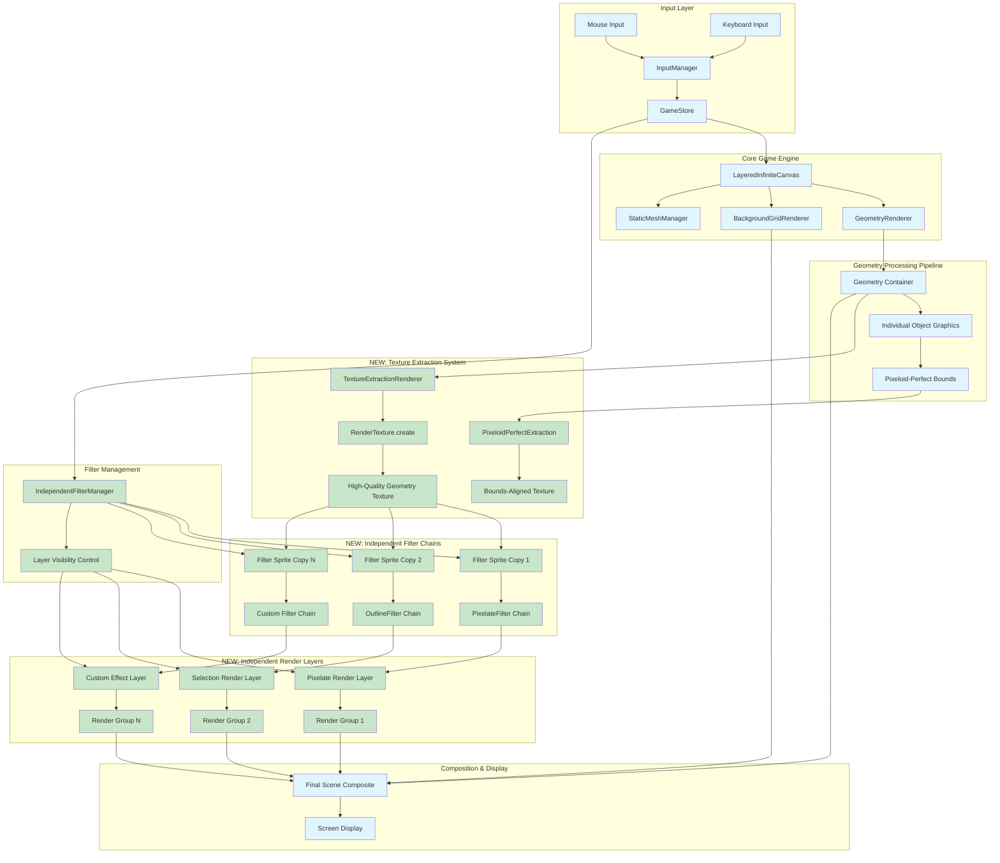
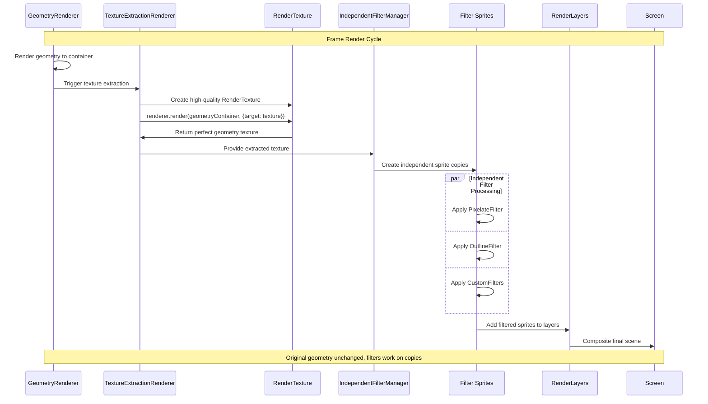
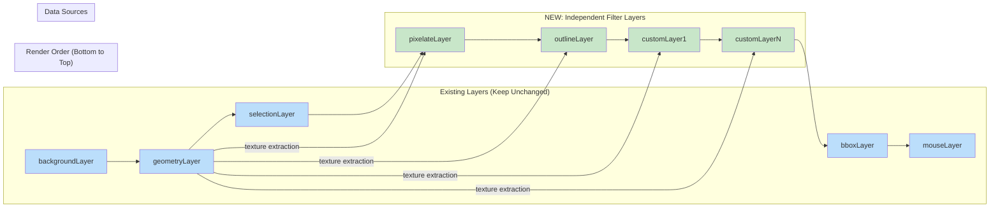

# Independent Filter System Architecture Diagram

## Complete System Overview



## Data Flow Architecture



## Pixeloid-Perfect Extraction Process

```mermaid
graph TD
    subgraph "Object Analysis"
        GeomObj[Geometric Object] --> Metadata[Object.metadata]
        Metadata --> Bounds[metadata.bounds]
        Bounds --> MinMax[minX, maxX, minY, maxY]
    end

    subgraph "Pixeloid Alignment"
        MinMax --> PixeloidCalc[Calculate Pixeloid Dimensions]
        PixeloidCalc --> PerfectWidth[ceil(maxX - minX) pixeloids]
        PixeloidCalc --> PerfectHeight[ceil(maxY - minY) pixeloids]
    end

    subgraph "Texture Creation"
        PerfectWidth --> TexWidth[width = pixeloids * scale]
        PerfectHeight --> TexHeight[height = pixeloids * scale]
        TexWidth --> CreateRT[RenderTexture.create]
        TexHeight --> CreateRT
        CreateRT --> PerfectTexture[Pixeloid-Perfect Texture]
    end

    subgraph "Extraction Container"
        GeomObj --> ExtractContainer[Temporary Container]
        Bounds --> Positioning[position.set(-minX, -minY)]
        ExtractContainer --> Positioning
        Positioning --> RenderTarget[renderer.render to texture]
        RenderTarget --> PerfectTexture
    end

    classDef analysis fill:#e3f2fd
    classDef alignment fill:#f3e5f5
    classDef creation fill:#e8f5e8
    classDef extraction fill:#fff8e1
    
    class GeomObj,Metadata,Bounds,MinMax analysis
    class PixeloidCalc,PerfectWidth,PerfectHeight alignment
    class TexWidth,TexHeight,CreateRT,PerfectTexture creation
    class ExtractContainer,Positioning,RenderTarget extraction
```

## Integration with Current LayeredInfiniteCanvas



## Filter Chain Configuration

```mermaid
graph TB
    subgraph "Filter Configuration Store"
        Config[FilterConfiguration]
        Config --> PixConfig[PixelateConfig]
        Config --> OutConfig[OutlineConfig]
        Config --> CustConfig[CustomConfig]
    end

    subgraph "Filter Factory"
        PixConfig --> PixFactory[createPixelateFilter]
        OutConfig --> OutFactory[createOutlineFilter]
        CustConfig --> CustFactory[createCustomFilter]
    end

    subgraph "Applied Filters"
        PixFactory --> PixFilter[PixelateFilter]
        OutFactory --> OutFilter[OutlineFilter]
        CustFactory --> CustFilter[CustomFilter]
    end

    subgraph "Sprite Assignment"
        PixFilter --> Sprite1[sprite.filters = [PixelateFilter]]
        OutFilter --> Sprite2[sprite.filters = [OutlineFilter]]
        CustFilter --> Sprite3[sprite.filters = [CustomFilter]]
    end

    subgraph "Layer Visibility Control"
        Sprite1 --> Layer1[layer.visible = store.filters.pixelate]
        Sprite2 --> Layer2[layer.visible = store.filters.outline]
        Sprite3 --> Layer3[layer.visible = store.filters.custom]
    end

    classDef config fill:#fff3e0
    classDef factory fill:#e8f5e8
    classDef filter fill:#f3e5f5
    classDef sprite fill:#e3f2fd
    classDef control fill:#fce4ec
    
    class Config,PixConfig,OutConfig,CustConfig config
    class PixFactory,OutFactory,CustFactory factory
    class PixFilter,OutFilter,CustFilter filter
    class Sprite1,Sprite2,Sprite3 sprite
    class Layer1,Layer2,Layer3 control
```

## Key Architectural Benefits

1. **Zero Impact on Original**: Geometry layer remains completely unchanged
2. **Perfect Fidelity**: RenderTexture extraction preserves exact pixel data  
3. **Independent Processing**: Each filter operates on its own sprite copy
4. **Parallel Execution**: Multiple filters can run simultaneously
5. **Composable Results**: Sprites can be layered and combined flexibly
6. **Performance Optimized**: Uses GPU-accelerated rendering pipeline
7. **Store Integration**: Integrates cleanly with existing visibility controls

This architecture enables the advanced filter capabilities you need while maintaining the integrity and performance of your existing system.