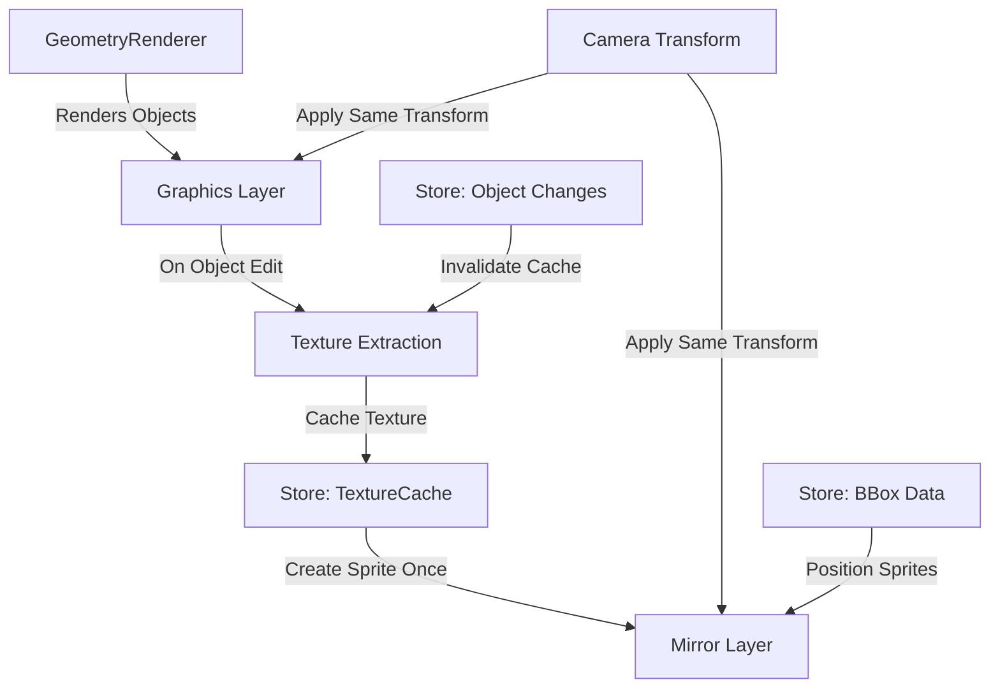

# Mirror Layer Implementation Plan

## Overview
Create a "mirror" layer that perfectly mirrors the geometry layer using cached texture sprites. The layer should only re-extract textures when objects are edited (not on camera movements) and use the store's bbox data for pixeloid-perfect positioning.

## Core Requirements
- Perfectly mirrors the geometry layer using cached texture sprites
- Only re-extracts textures when objects are edited (not on camera movements)
- Uses the store's bbox data for pixeloid-perfect positioning
- Moves and scales with the camera just like the geometry layer
- Store coordinates both layers

## Architecture



## Implementation Phases

### Phase 1: Rename and Refactor
1. Rename `BboxTextureTestRenderer` to `MirrorLayerRenderer`
2. Update all references from "bboxTest" to "mirror" in:
   - LayeredInfiniteCanvas
   - gameStore layerVisibility
   - UI components
3. Simplify the renderer to focus only on mirroring

### Phase 2: Store-Driven Texture Caching
1. Add texture cache management to the store:
   ```typescript
   interface ObjectTextureCache {
     texture: RenderTexture;
     version: number; // Increment on object edit
     lastExtracted: number; // Timestamp
     bounds: BBox; // Store bounds used for extraction
   }
   ```

2. Create efficient change detection:
   - Track object modification timestamps
   - Version numbers for each object
   - Invalidate cache on property changes

### Phase 3: Fix Coordinate System
1. **Current Issue**: GeometryRenderer draws in vertex space with offset conversion
2. **Solution**: 
   - Extract textures in the same coordinate space as GeometryRenderer renders
   - Position sprites using exact same coordinate system
   - Let the camera transform handle all scaling/positioning

### Phase 4: Reactive Updates
1. Subscribe to object changes in store
2. Only re-extract textures when:
   - Object visual properties change (color, size, stroke)
   - Object geometry changes (position, dimensions)
   - Object is added/removed
   - NOT when camera moves/zooms

## Key Implementation Details

### 1. Texture Extraction (one-time per object edit)
```typescript
// Extract in the same coordinate space as rendered
const extractObjectTexture = (objectGraphics: Graphics, bounds: BBox, pixeloidScale: number) => {
  // Calculate texture size based on bounds
  const textureWidth = Math.ceil((bounds.maxX - bounds.minX) * pixeloidScale);
  const textureHeight = Math.ceil((bounds.maxY - bounds.minY) * pixeloidScale);
  
  const texture = RenderTexture.create({
    width: textureWidth,
    height: textureHeight,
    scaleMode: 'nearest' // Pixel-perfect
  });
  
  // Render with offset to capture just the object
  renderer.render({
    container: objectGraphics,
    target: texture,
    transform: new Matrix()
      .scale(pixeloidScale, pixeloidScale)
      .translate(-bounds.minX, -bounds.minY)
  });
  
  return texture;
}
```

### 2. Sprite Positioning (reactive to camera)
```typescript
// Position sprite at exact vertex coordinates (same as geometry)
const offset = gameStore.mesh.vertex_to_pixeloid_offset;
sprite.position.set(
  bounds.minX - offset.x,
  bounds.minY - offset.y
);
// Camera transform will handle the rest
```

### 3. Cache Management
```typescript
// Only extract if object changed
const cache = textureCache.get(object.id);
if (!cache || object.version > cache.version) {
  // Extract new texture
  const newTexture = extractObjectTexture(graphics, bounds, scale);
  
  // Update cache
  textureCache.set(object.id, {
    texture: newTexture,
    version: object.version,
    lastExtracted: Date.now(),
    bounds: bounds
  });
  
  // Destroy old texture
  cache?.texture.destroy();
}
```

### 4. Store Integration
- Add object versioning to gameStore
- Track texture cache in store
- Invalidate cache on object updates
- Coordinate both layers through store

## Benefits
- ✅ Textures only extracted on object changes
- ✅ Perfect mirror of geometry layer
- ✅ Efficient caching reduces GPU load
- ✅ Sprites move naturally with camera
- ✅ Store coordinates both layers
- ✅ No re-extraction on zoom/pan

## Current Code State Analysis

### Files to Modify
1. **BboxTextureTestRenderer.ts** → **MirrorLayerRenderer.ts**
   - Currently extracts textures on every render (inefficient)
   - Uses incorrect coordinate transformation
   - Needs proper caching mechanism

2. **LayeredInfiniteCanvas.ts**
   - References to `bboxTestLayer` → `mirrorLayer`
   - References to `bboxTextureTestRenderer` → `mirrorLayerRenderer`
   - Method `renderBboxTestLayer` → `renderMirrorLayer`

3. **types/index.ts**
   - `layerVisibility.bboxTest` → `layerVisibility.mirror`

4. **gameStore.ts**
   - Add object versioning system
   - Add texture cache management
   - Track object modifications

### Key Issues Found
1. **Coordinate System Mismatch**
   - GeometryRenderer converts from pixeloid to vertex coordinates in `convertObjectToVertexCoordinates()`
   - Texture extraction tries to use pixeloid coordinates directly
   - Need to match the exact same transformation

2. **No Caching**
   - Currently re-extracts textures every frame
   - No change detection
   - Memory leak potential from not destroying old textures

3. **Transform Issues**
   - The pixeloid scale is not properly applied during extraction
   - Sprite positioning doesn't match geometry positioning

## Implementation Tasks

### Task 1: Rename Components
- [ ] Rename `BboxTextureTestRenderer` to `MirrorLayerRenderer`
- [ ] Update all imports and references
- [ ] Update layer visibility property name
- [ ] Update UI labels

### Task 2: Add Store Support
- [ ] Add object version tracking to GeometricObject types
- [ ] Create texture cache state in store
- [ ] Add methods to track object modifications
- [ ] Implement cache invalidation logic

### Task 3: Fix Coordinate System
- [ ] Match GeometryRenderer's coordinate conversion exactly
- [ ] Use vertex coordinates for texture extraction
- [ ] Apply same positioning logic for sprites
- [ ] Test with different zoom levels

### Task 4: Implement Caching
- [ ] Create texture cache Map in MirrorLayerRenderer
- [ ] Track object versions
- [ ] Only extract when version changes
- [ ] Properly destroy old textures

### Task 5: Optimize Performance
- [ ] Batch texture extractions
- [ ] Use texture pooling
- [ ] Implement smart viewport culling
- [ ] Add performance metrics

### Task 6: Testing & Validation
- [ ] Verify pixel-perfect alignment
- [ ] Test with object edits
- [ ] Validate memory usage
- [ ] Check performance with many objects