# Complete Circle Movement Bug Fix Plan - Root Cause Analysis & Solution

**Date**: July 19, 2025  
**Status**: **ROOT CAUSE IDENTIFIED** - Complete system analysis with exact fixes  
**Mode**: Architect Analysis → Ready for Code Implementation  

---

## 🚨 **CRITICAL FINDINGS: VERTEX FORMAT DISASTER**

After comprehensive investigation, the bugs stem from **fundamental vertex format mismatches** and **missing architectural constraints**:

### **🎯 ISSUE 1: Circle Radius = 0 - VERTEX FORMAT MISMATCH**

**Root Cause**: Drawing system and property system use **incompatible vertex formats**

```mermaid
graph TD
    A[User draws circle] --> B[GeometryHelper_3b.calculateCirclePreview]
    B --> C["vertices: [center, radiusPoint] ❌"]
    C --> D[finishDrawing creates object]
    D --> E[createGeometricObject]
    E --> F[GeometryPropertyCalculators.calculateCircleProperties]
    F --> G["Expects: [8 circumference vertices] ❌"]
    G --> H[Circumcenter calculation FAILS]
    H --> I["Fallback: wrong center/radius ❌"]
    I --> J[Object stored with radius = 0]
    J --> K[Edit panel shows radius = 0]
```



**Evidence**:
- `GeometryHelper_3b.calculateCirclePreview()` lines 116-119: Returns `[center, radiusPoint]`
- `GeometryPropertyCalculators.calculateCircleProperties()` lines 63-125: Expects circumference vertices
- `createGeometricObject()` lines 382-392: Fallback treats `vertices[1]` as radiusPoint when it's actually circumference point

### **🎯 ISSUE 2: Diamond Isometric - MISSING CONSTRAINT ENFORCEMENT**

**Root Cause**: **Zero isometric ratio enforcement** in edit preview system

**Evidence**:
- `gameStore_3b.updateEditPreview()` lines 1551-1558: Accepts any width/height values
- `GeometryVertexGenerators.generateDiamondFromProperties()`: No ratio constraints
- User can set width=100, height=50 → system allows non-isometric diamonds

### **🎯 ISSUE 3: Rectangle Movement - WRONG DATA PATH**

**Root Cause**: Position-only changes trigger **full regeneration** instead of **vertex translation**

**Evidence**:
- All rectangle edits go through `updateEditPreview()` → full vertex regeneration
- No detection of position-only vs size changes
- `updateObjectPosition()` exists but never used by edit system

---

## 🔧 **COMPLETE SOLUTION ARCHITECTURE**

### **🟢 FIX 1: Circle Vertex Format Standardization**

**RECOMMENDED: Fix Drawing System Output**

**File**: `app/src/game/GeometryHelper_3b.ts`
**Method**: `calculateCirclePreview()` lines 99-137

**Change Required**:
```typescript
// ❌ CURRENT: Returns [center, radiusPoint]
vertices: [
  { x: centerX, y: centerY },              // center
  { x: centerX + radius, y: centerY }      // radiusPoint  
],

// ✅ FIXED: Returns [8 circumference vertices] 
vertices: GeometryVertexGenerators.generateCircleFromProperties(
  { x: centerX, y: centerY }, 
  radius
),
```

**Impact**: Property calculation will work correctly, radius displayed properly

### **🟢 FIX 2: Diamond Isometric Constraint Enforcement**

**File**: `app/src/store/gameStore_3b.ts`
**Method**: `updateEditPreview()` lines 1551-1558

**Change Required**:
```typescript
case 'diamond':
  const diamondCenter = { x: formData.diamond!.centerX, y: formData.diamond!.centerY }
  let diamondWidth = formData.diamond!.width
  let diamondHeight = formData.diamond!.height
  
  // ✅ NEW: Enforce isometric ratio (2:1 width:height)
  const targetRatio = 2.0  // Isometric diamond ratio
  const currentRatio = diamondWidth / diamondHeight
  
  if (Math.abs(currentRatio - targetRatio) > 0.01) {
    // Auto-adjust to maintain isometric proportions
    diamondHeight = diamondWidth / targetRatio  // Preserve width, adjust height
    console.log(`Diamond isometric constraint: width=${diamondWidth}, height=${diamondHeight}`)
  }
  
  previewVertices = GeometryVertexGenerators.generateDiamondFromProperties(diamondCenter, diamondWidth, diamondHeight)
```

**Impact**: Diamond maintains isometric proportions during editing

### **🟢 FIX 3: Rectangle Movement vs Size Path Separation**

**File**: `app/src/store/gameStore_3b.ts`
**Method**: `updateEditPreview()` lines 1542-1549

**Change Required**:
```typescript
case 'rectangle':
  const rectCenter = { x: formData.rectangle!.centerX, y: formData.rectangle!.centerY }
  const rectWidth = formData.rectangle!.width
  const rectHeight = formData.rectangle!.height
  
  // ✅ NEW: Detect change type
  const originalProps = gameStore_3b.editPreview.originalObject!.properties
  if (originalProps?.type === 'rectangle') {
    const positionChanged = Math.abs(rectCenter.x - originalProps.center.x) > 0.01 ||
                           Math.abs(rectCenter.y - originalProps.center.y) > 0.01
    const sizeChanged = Math.abs(rectWidth - originalProps.width) > 0.01 ||
                       Math.abs(rectHeight - originalProps.height) > 0.01
    
    if (positionChanged && !sizeChanged) {
      // ✅ POSITION ONLY: Use movement-based approach (preserves shape)
      const offset = {
        x: rectCenter.x - originalProps.center.x,
        y: rectCenter.y - originalProps.center.y
      }
      previewVertices = gameStore_3b.editPreview.originalObject!.vertices.map(v => ({
        x: v.x + offset.x,
        y: v.y + offset.y
      }))
    } else {
      // ✅ SIZE CHANGE: Use regeneration approach
      previewVertices = GeometryVertexGenerators.generateRectangleFromProperties(rectCenter, rectWidth, rectHeight)
    }
  } else {
    // Fallback to regeneration
    previewVertices = GeometryVertexGenerators.generateRectangleFromProperties(rectCenter, rectWidth, rectHeight)
  }
```

**Impact**: Rectangle position changes preserve exact dimensions, size changes work correctly

---

## 📊 **DATA FLOW AFTER FIXES**

### **✅ CORRECTED CIRCLE FLOW**
```
User draws circle → GeometryHelper_3b → [8 circumference vertices] 
                 → createGeometricObject → GeometryPropertyCalculators 
                 → Correct properties → Edit panel shows correct radius
```

### **✅ CORRECTED DIAMOND FLOW**
```
User edits diamond → updateEditPreview → Isometric constraint enforcement 
                  → Auto-adjusted dimensions → Proper isometric diamond
```

### **✅ CORRECTED RECTANGLE FLOW**
```
User moves rectangle → Position change detected → Movement-based update 
                    → Vertices translated → Perfect dimension preservation

User resizes rectangle → Size change detected → Regeneration-based update 
                       → New vertices generated → Correct new dimensions
```

---

## 🧪 **TESTING STRATEGY**

### **Circle Test Cases**
1. Draw circle with radius 50 → Edit panel should show radius 50
2. Edit circle radius to 75 → Circle should render with radius 75
3. Move circle position → Radius should remain unchanged

### **Diamond Test Cases**  
1. Draw diamond → Should maintain isometric proportions
2. Edit diamond width to 100 → Height should auto-adjust to 50
3. Edit diamond height to 60 → Width should auto-adjust to 120

### **Rectangle Test Cases**
1. Move rectangle position → Width/height should remain identical
2. Resize rectangle → New dimensions should be exact
3. Move then resize → No dimension drift or corruption

---

## 🎯 **IMPLEMENTATION ORDER**

1. **HIGH PRIORITY: Fix 1 (Circle vertex format)** - Solves radius = 0 issue
2. **HIGH PRIORITY: Fix 2 (Diamond isometric)** - Solves proportion breaks  
3. **MEDIUM PRIORITY: Fix 3 (Rectangle paths)** - Solves movement corruption

**Estimated Implementation Time**: 2-3 hours for all fixes
**Risk Level**: Low - Changes are surgical and well-isolated

---

## ✅ **SUCCESS CRITERIA**

After implementation, the following must work perfectly:

### **Circle Requirements**
- ✅ Edit panel displays correct radius value from stored object
- ✅ Radius changes update circle size correctly
- ✅ Position changes preserve radius exactly
- ✅ No spontaneous radius drift or corruption

### **Diamond Requirements**
- ✅ Width/height changes maintain isometric ratio (2:1)
- ✅ User cannot create non-isometric diamonds
- ✅ Auto-adjustment preserves user's primary dimension

### **Rectangle Requirements**
- ✅ Position-only changes preserve dimensions exactly
- ✅ Size-only changes work correctly
- ✅ No dimension corruption during any operation

---

## 📋 **NEXT STEPS**

**READY FOR CODE MODE IMPLEMENTATION:**

1. Switch to Code mode
2. Implement Fix 1 (Circle vertex format)  
3. Test circle editing functionality
4. Implement Fix 2 (Diamond isometric constraints)
5. Test diamond editing functionality  
6. Implement Fix 3 (Rectangle path separation)
7. Test rectangle editing functionality
8. Comprehensive integration testing

**The root causes are definitively identified. The fixes are precisely specified. Implementation can begin immediately.**

---

**Status**: ✅ **ANALYSIS COMPLETE** - Ready for Code Mode Implementation  
**Architecture**: All pathways mapped, all fixes designed, all test cases specified  
**Confidence**: High - Root causes are confirmed with concrete evidence