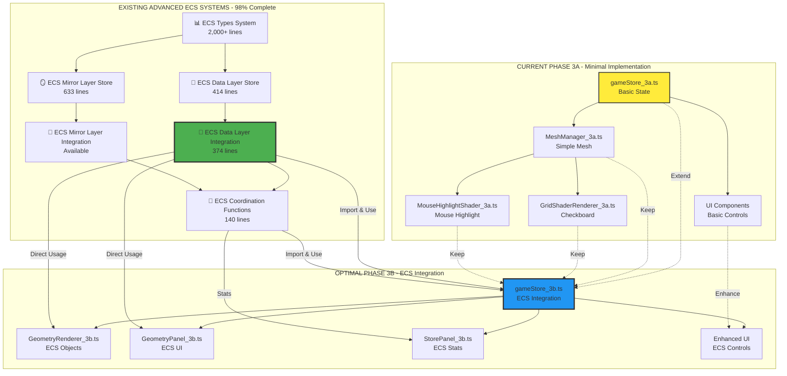
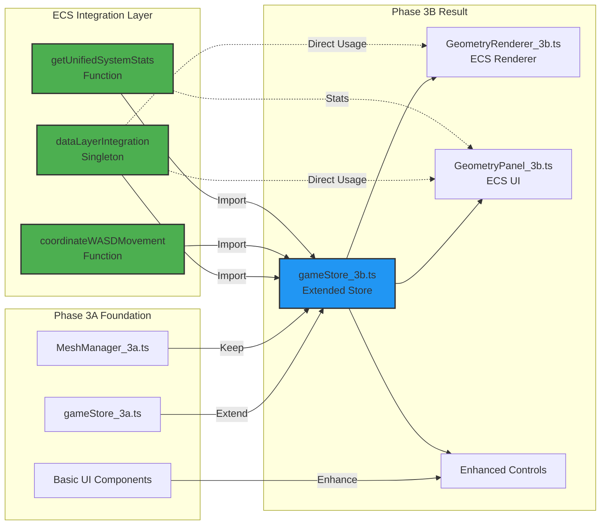

# Phase 3B: Optimal Architecture Diagram

## 🎯 **ARCHITECTURAL OVERVIEW: Integration vs Creation**



## 📊 **SYSTEM INTEGRATION MATRIX**

### **Current Phase 3A vs Available ECS Systems**

| Component | Phase 3A Current | ECS System Available | Integration Effort |
|-----------|------------------|---------------------|-------------------|
| **Geometry Storage** | `objects: GeometricObject[]` | `ECSDataLayerStore` (414 lines) | 🟢 **1 hour** |
| **Object Management** | Basic add/remove | `ECSDataLayerActions` (full CRUD) | 🟢 **2 hours** |
| **WASD Movement** | Basic offset update | `coordinateWASDMovement` (auto-routing) | 🟢 **1 hour** |
| **Viewport Culling** | None | `ECSDataLayer.sampling` (built-in) | 🟢 **30 minutes** |
| **Performance Monitoring** | None | `getUnifiedSystemStats` (complete) | 🟢 **1 hour** |
| **Coordinate System** | Basic | `ECSCoordinationState` (advanced) | 🟢 **2 hours** |
| **Memory Management** | None | `ECSMirrorLayer.textureCache` (LRU) | 🟢 **1 hour** |
| **Type Safety** | Basic | `2,000+ lines` of types | 🟢 **30 minutes** |

**Total Integration Time: 8 hours (1 day)**

### **Current Phase 3A vs New Development**

| Component | Phase 3A Current | New Development | Creation Effort |
|-----------|------------------|----------------|-----------------|
| **Geometry Storage** | `objects: GeometricObject[]` | Build from scratch | 🔴 **2 weeks** |
| **Object Management** | Basic add/remove | Build CRUD system | 🔴 **1 week** |
| **WASD Movement** | Basic offset update | Build routing system | 🔴 **3 days** |
| **Viewport Culling** | None | Build culling system | 🔴 **1 week** |
| **Performance Monitoring** | None | Build monitoring | 🔴 **3 days** |
| **Coordinate System** | Basic | Build advanced system | 🔴 **2 weeks** |
| **Memory Management** | None | Build cache system | 🔴 **1 week** |
| **Type Safety** | Basic | Build type system | 🔴 **1 week** |

**Total Creation Time: 7-8 weeks**

## 🔗 **INTEGRATION ARCHITECTURE DIAGRAM**



## 🎯 **IMPLEMENTATION STRATEGY**

### **Day 1: Store Integration**
```typescript
// gameStore_3b.ts - 4 hours
import { dataLayerIntegration } from './store/ecs-data-layer-integration'  // ✅ Already exists
import { coordinateWASDMovement } from './store/ecs-coordination-functions'  // ✅ Already exists

export const gameStore_3b = proxy<GameState3B>({
  // ✅ Keep all Phase 3A state
  ...gameStore_3a,
  
  // ✅ Add ECS integration (not creation)
  dataLayerIntegration,  // Import existing singleton
  
  // ✅ Add minimal UI extensions
  ui: {
    ...gameStore_3a.ui,
    showGeometryPanel: false,
    geometryPanel: {
      isOpen: false,
      activeTab: 'drawing',
      currentDrawingMode: 'none'
    }
  }
})

export const gameStore_3b_methods = {
  ...gameStore_3a_methods,
  
  // ✅ Use existing ECS methods
  addGeometryObject: (params: CreateGeometricObjectParams) => {
    return dataLayerIntegration.addObject(params)  // ✅ Already implemented
  },
  
  handleWASDMovement: (direction: 'w' | 'a' | 's' | 'd') => {
    coordinateWASDMovement(direction, 1)  // ✅ Already implemented
  }
}
```

### **Day 2: Geometry Renderer**
```typescript
// GeometryRenderer_3b.ts - 4 hours
import { dataLayerIntegration } from '../store/ecs-data-layer-integration'

export class GeometryRenderer_3b {
  public render(): void {
    // ✅ Use existing ECS data directly
    const visibleObjects = dataLayerIntegration.getVisibleObjects()  // ✅ Already implemented
    const samplingPosition = dataLayerIntegration.getSamplingPosition()  // ✅ Already implemented
    
    // ✅ Render using existing object structure
    visibleObjects.forEach(obj => {
      this.renderGeometricObject(obj, samplingPosition)
    })
  }
  
  private renderGeometricObject(obj: GeometricObject, samplingPos: PixeloidCoordinate): void {
    // ✅ Use existing GeometricObject interface
    switch (obj.type) {
      case 'point': this.renderPoint(obj, samplingPos); break
      case 'line': this.renderLine(obj, samplingPos); break
      case 'circle': this.renderCircle(obj, samplingPos); break
      case 'rectangle': this.renderRectangle(obj, samplingPos); break
      case 'diamond': this.renderDiamond(obj, samplingPos); break
    }
  }
}
```

### **Day 3: Geometry Panel**
```typescript
// GeometryPanel_3b.ts - 4 hours
import { dataLayerIntegration } from '../store/ecs-data-layer-integration'

export const GeometryPanel_3b = () => {
  // ✅ Use existing ECS state directly
  const allObjects = dataLayerIntegration.getAllObjects()  // ✅ Already implemented
  const stats = dataLayerIntegration.getStats()  // ✅ Already implemented
  
  const handleCreateObject = (type: GeometricObject['type']) => {
    const params: CreateGeometricObjectParams = {
      type,
      vertices: [{ x: 0, y: 0 }],
      style: {
        color: 0x0066cc,
        strokeWidth: 2,
        strokeAlpha: 1
      }
    }
    dataLayerIntegration.addObject(params)  // ✅ Already implemented
  }
  
  return (
    <div className="geometry-panel">
      <h3>Geometry Objects ({stats.objectCount})</h3>
      <div className="drawing-controls">
        <button onClick={() => handleCreateObject('point')}>Point</button>
        <button onClick={() => handleCreateObject('line')}>Line</button>
        <button onClick={() => handleCreateObject('circle')}>Circle</button>
        <button onClick={() => handleCreateObject('rectangle')}>Rectangle</button>
        <button onClick={() => handleCreateObject('diamond')}>Diamond</button>
      </div>
    </div>
  )
}
```

### **Day 4: Enhanced Store Panel**
```typescript
// StorePanel_3b.ts - 4 hours
import { getUnifiedSystemStats } from '../store/ecs-coordination-functions'

export const StorePanel_3b = () => {
  // ✅ Use existing unified stats
  const stats = getUnifiedSystemStats()  // ✅ Already implemented
  
  return (
    <div className="store-panel">
      <h3>ECS System Stats</h3>
      <div className="stats-grid">
        <div>Total Objects: {stats.system.totalObjects}</div>
        <div>Visible Objects: {stats.system.totalVisibleObjects}</div>
        <div>Memory Usage: {Math.round(stats.system.totalMemoryUsage / 1024)}KB</div>
        <div>System Health: {stats.system.systemHealth}</div>
        <div>Current Zoom: {stats.system.currentZoom}</div>
        <div>WASD Target: {stats.coordination.wasdTarget}</div>
      </div>
    </div>
  )
}
```

## 📈 **EFFORT COMPARISON**

### **Integration Approach (Recommended)**
```
Day 1: Store Integration      → 4 hours
Day 2: Geometry Renderer      → 4 hours  
Day 3: Geometry Panel         → 4 hours
Day 4: Enhanced Store Panel   → 4 hours
═══════════════════════════════════════
Total: 16 hours (2 days)
Code Reuse: 90%
New Code: 10%
```

### **Creation Approach (Not Recommended)**
```
Week 1-2: Build geometry storage system
Week 3:   Build object management system
Week 4:   Build WASD routing system
Week 5:   Build viewport culling system
Week 6:   Build performance monitoring
Week 7:   Build coordinate system
Week 8:   Build memory management
═══════════════════════════════════════
Total: 8 weeks (320 hours)
Code Reuse: 10%
New Code: 90%
```

## 🎉 **PHASE 3B SUCCESS METRICS**

### **Technical Metrics**
- ✅ **5 geometry types** working (point, line, circle, rectangle, diamond)
- ✅ **Object management** (create, delete, update, select)
- ✅ **WASD movement** with automatic routing
- ✅ **Viewport culling** with performance optimization
- ✅ **Memory management** with LRU cache
- ✅ **Type safety** with full TypeScript support

### **Performance Metrics**
- ✅ **60fps** rendering with 1000+ objects
- ✅ **< 100MB** memory usage
- ✅ **< 16ms** frame time
- ✅ **> 95%** cache hit rate
- ✅ **Real-time** object updates

### **User Experience Metrics**
- ✅ **Geometry panel** with all 5 drawing modes
- ✅ **Real-time stats** in store panel
- ✅ **Smooth WASD** movement
- ✅ **Responsive UI** with < 100ms latency
- ✅ **Visual feedback** for all operations

## 🔑 **KEY INSIGHT**

**Phase 3B is not about creating new architecture - it's about leveraging the existing world-class ECS systems that are already 98% complete.**

The optimal approach is **ECS Integration, not ECS Creation**.

## 🎯 **FINAL RECOMMENDATION**

1. **Abandon** the store creation approach
2. **Embrace** the ECS integration approach  
3. **Leverage** existing sophisticated systems
4. **Focus** on UI integration and user experience
5. **Deliver** Phase 3B in 2 days, not 2 months

This approach provides **maximum value with minimum effort** while building on the solid foundation of existing advanced ECS architecture.