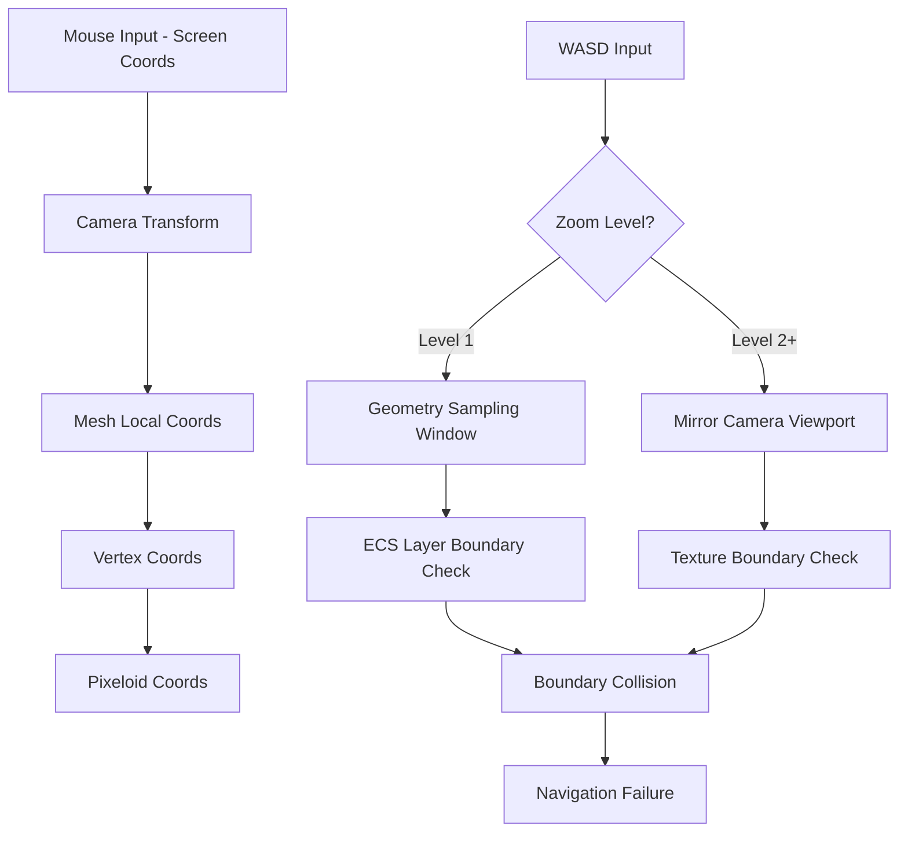

# Spatial Navigation Analysis: Deep Dive into Coordinate System Boundaries and Mesh Interactions

## Executive Summary

This analysis examines the spatial navigation complexities in the dual-layer ECS system, focusing on boundary conditions, mesh collision detection, and the interaction between camera transforms and coordinate spaces.

## Core Spatial Navigation Concerns

### 1. **Mesh Boundary Collisions - The Critical Issue**

#### Current Mesh System Architecture
**File**: [`StaticMeshManager.ts:102-106`](app/src/game/StaticMeshManager.ts)
```typescript
meshBounds: {
  vertexWidth: Math.ceil(oversizedSize / pixeloidScale),
  vertexHeight: Math.ceil(oversizedSize / pixeloidScale)
}
```

#### The Boundary Problem
- **Mesh has finite bounds**: `vertexWidth × vertexHeight` at each zoom level
- **WASD movement can exceed these bounds**: No boundary checking in InputManager
- **Result**: Coordinate system breaks when accessing unmapped vertices

#### Zoom-Level Boundary Behavior
```
Zoom Level 1:  WASD moves geometry sampling window
Zoom Level 2+: WASD moves mirror layer camera viewport

At each zoom level, different boundary constraints apply:
- Zoom 1: Limited by ECS geometry objects spatial extent
- Zoom 2+: Limited by pre-rendered geometry layer texture size
```

### 2. **Camera Transform vs Mesh Collision Detection**

#### Current Camera Transform System
**File**: [`InfiniteCanvas.ts:268-273`](app/src/game/InfiniteCanvas.ts)
```typescript
// Camera transform applies scale and position
this.cameraTransform.scale.set(this.localPixeloidScale)
this.cameraTransform.position.set(transformPosition.x, transformPosition.y)
```

#### Mesh Collision Detection Issues
**File**: [`BackgroundGridRenderer.ts:330-340`](app/src/game/BackgroundGridRenderer.ts)
```typescript
// Mesh collision uses local coordinates
const localPos = event.getLocalPosition(this.mesh)
const vertexX = Math.floor(localPos.x)
const vertexY = Math.floor(localPos.y)
```

#### The Collision Problem
- **Mesh collision detection operates in mesh-local coordinates**
- **Camera transform affects screen-to-mesh coordinate conversion**
- **Different zoom levels have different mesh resolutions**
- **Result**: Mouse collision detection may fail at mesh boundaries

### 3. **Coordinate Space Transformations During Navigation**

#### Three-Layer Coordinate System
```
Layer 1: Screen Pixels (raw input)
    ↓ Camera Transform
Layer 2: Mesh Vertices (collision detection)
    ↓ Offset Conversion
Layer 3: Pixeloid Coordinates (game world)
```

#### Navigation State Transitions


### 4. **Boundary Detection and Handling**

#### Missing Boundary Systems
Currently, no boundary checking exists for:
- **Mesh vertex limits**: No check if `vertexX/Y` exceeds mesh bounds
- **ECS geometry extent**: No check if sampling window exceeds available objects
- **Texture boundaries**: No check if mirror viewport exceeds rendered texture

#### Required Boundary Validation
```typescript
// Required boundary checks for spatial navigation
interface NavigationBoundaries {
  meshBounds: {
    minX: number, maxX: number,
    minY: number, maxY: number
  }
  geometryBounds: {
    minX: number, maxX: number,
    minY: number, maxY: number
  }
  textureBounds: {
    width: number, height: number
  }
}
```

## Predicted vs Measured Data Analysis

### Current Data Flow Issues
The system has multiple coordinate calculation paths that may produce different results:

#### Path A: Direct Mesh Collision (Currently Active)
```typescript
// BackgroundGridRenderer.ts:338-350
const vertexX = Math.floor(localPos.x)
const vertexY = Math.floor(localPos.y)
gameStore.mouse.vertex_position.x = vertexX  // DIRECT MUTATION
```

#### Path B: ECS Coordinate Conversion (Unused)
```typescript
// gameStore.ts:268-291
const vertexX = Math.floor(screenPos.x / scale)
const vertexY = Math.floor(screenPos.y / scale)
// CALCULATED CONVERSION
```

#### Data Consistency Problems
- **Predicted**: What the ECS system calculates coordinates should be
- **Measured**: What the mesh collision system actually detects
- **Discrepancy**: Differences between predicted and measured values

### Proposed Store UI Enhancement

#### Current Store Display
**File**: [`StorePanel.ts:138-150`](app/src/ui/StorePanel.ts)
```typescript
// Shows only measured values
updateElement(this.elements, 'mouse-position', 
  formatCoordinates(gameStore.mouse.screen_position.x, gameStore.mouse.screen_position.y, 0)
)
```

#### Enhanced Store UI Design
```typescript
// New predicted vs measured display
interface CoordinateComparison {
  predicted: {
    screen: { x: number, y: number }
    vertex: { x: number, y: number }
    pixeloid: { x: number, y: number }
  }
  measured: {
    screen: { x: number, y: number }
    vertex: { x: number, y: number }
    pixeloid: { x: number, y: number }
  }
  discrepancy: {
    screen: { x: number, y: number }
    vertex: { x: number, y: number }
    pixeloid: { x: number, y: number }
  }
}
```

## Clean Store UI Component Design

### Current Store UI Issues
1. **Mixed data sources**: Some values from direct mutations, others from calculations
2. **No validation indicators**: No way to see if coordinates are consistent
3. **Missing boundary information**: No display of current navigation limits
4. **No prediction comparison**: Can't see calculated vs actual values

### Enhanced Store UI Architecture

#### Section 1: Coordinate System Validation
```typescript
// Real-time coordinate consistency checking
<div class="coordinate-validation">
  <h3>Coordinate System Health</h3>
  <div class="validation-row">
    <span>Path A (Mesh): </span>
    <span class={pathAStatus}>✓ Active</span>
  </div>
  <div class="validation-row">
    <span>Path B (ECS): </span>
    <span class={pathBStatus}>⚠ Unused</span>
  </div>
  <div class="validation-row">
    <span>Consistency: </span>
    <span class={consistencyStatus}>❌ Inconsistent</span>
  </div>
</div>
```

#### Section 2: Predicted vs Measured Display
```typescript
// Side-by-side comparison
<div class="coordinate-comparison">
  <h3>Coordinate Comparison</h3>
  <table>
    <thead>
      <tr><th>Type</th><th>Predicted</th><th>Measured</th><th>Diff</th></tr>
    </thead>
    <tbody>
      <tr>
        <td>Screen</td>
        <td>{predictedScreen}</td>
        <td>{measuredScreen}</td>
        <td class={screenDiffClass}>{screenDiff}</td>
      </tr>
      <tr>
        <td>Vertex</td>
        <td>{predictedVertex}</td>
        <td>{measuredVertex}</td>
        <td class={vertexDiffClass}>{vertexDiff}</td>
      </tr>
      <tr>
        <td>Pixeloid</td>
        <td>{predictedPixeloid}</td>
        <td>{measuredPixeloid}</td>
        <td class={pixeloidDiffClass}>{pixeloidDiff}</td>
      </tr>
    </tbody>
  </table>
</div>
```

#### Section 3: Spatial Navigation Boundaries
```typescript
// Current navigation limits
<div class="navigation-boundaries">
  <h3>Navigation Boundaries</h3>
  <div class="boundary-info">
    <div class="mesh-bounds">
      <span>Mesh Bounds: </span>
      <span>{meshBounds.width}×{meshBounds.height}</span>
    </div>
    <div class="geometry-bounds">
      <span>Geometry Extent: </span>
      <span>{geometryBounds.minX},{geometryBounds.minY} to {geometryBounds.maxX},{geometryBounds.maxY}</span>
    </div>
    <div class="navigation-safety">
      <span>Navigation Safety: </span>
      <span class={safetyStatus}>{safetyLevel}</span>
    </div>
  </div>
</div>
```

#### Section 4: ECS Layer State
```typescript
// Current ECS layer status
<div class="ecs-layer-status">
  <h3>ECS Layer Status</h3>
  <div class="layer-info">
    <div class="zoom-level">
      <span>Zoom Level: </span>
      <span class="zoom-value">{zoomLevel}</span>
    </div>
    <div class="active-layer">
      <span>Active Layer: </span>
      <span class={activeLayerClass}>{activeLayer}</span>
    </div>
    <div class="wasd-target">
      <span>WASD Target: </span>
      <span class={wasdTargetClass}>{wasdTarget}</span>
    </div>
  </div>
</div>
```

## Mesh System Interaction Analysis

### Current Mesh Collision System
**File**: [`BackgroundGridRenderer.ts:294-356`](app/src/game/BackgroundGridRenderer.ts)

#### Mesh Interaction Pipeline
1. **PixiJS Event System**: `mesh.on('globalpointermove', event)`
2. **Local Coordinate Extraction**: `event.getLocalPosition(this.mesh)`
3. **Vertex Calculation**: `Math.floor(localPos.x/y)`
4. **Store Mutation**: Direct `gameStore.mouse.vertex_position` update

#### Camera Transform Impact
```typescript
// Camera transform affects mesh coordinates
this.cameraTransform.scale.set(this.localPixeloidScale)
this.cameraTransform.position.set(transformPosition.x, transformPosition.y)

// But mesh collision detection may not account for this transform
const localPos = event.getLocalPosition(this.mesh)  // Uses mesh-local coordinates
```

### Proposed Mesh System Improvements

#### 1. **Boundary-Aware Mesh Collision**
```typescript
private handleMeshPointerEvent(event: any, eventType: string): void {
  const localPos = event.getLocalPosition(this.mesh)
  const vertexX = Math.floor(localPos.x)
  const vertexY = Math.floor(localPos.y)
  
  // NEW: Boundary validation
  const meshBounds = this.getCurrentMeshBounds()
  if (vertexX < 0 || vertexX >= meshBounds.width || 
      vertexY < 0 || vertexY >= meshBounds.height) {
    console.warn('Mesh collision outside bounds:', {vertexX, vertexY, meshBounds})
    return // Don't process out-of-bounds events
  }
  
  // Continue with coordinate updates...
}
```

#### 2. **Transform-Aware Collision Detection**
```typescript
private handleMeshPointerEvent(event: any, eventType: string): void {
  // Account for camera transform in collision detection
  const globalPos = event.getGlobalPosition()
  const transformedPos = this.cameraTransform.toLocal(globalPos)
  
  // Use transform-aware coordinates
  const vertexX = Math.floor(transformedPos.x)
  const vertexY = Math.floor(transformedPos.y)
  
  // Continue with boundary-checked processing...
}
```

#### 3. **Multi-Resolution Mesh Support**
```typescript
private updateMeshForZoomLevel(zoomLevel: number): void {
  const meshResolution = this.staticMeshManager.calculateMeshResolution(zoomLevel)
  
  // Update mesh collision detection for new resolution
  this.setupMeshInteraction(meshResolution)
  
  // Update boundary constraints
  this.updateNavigationBoundaries(meshResolution)
}
```

## Implementation Strategy

### Phase 1: Boundary System Implementation
1. **Add boundary validation to mesh collision detection**
2. **Implement navigation boundary checking in InputManager**
3. **Create boundary violation handling (elastic boundaries vs hard stops)**

### Phase 2: Enhanced Store UI
1. **Implement predicted vs measured coordinate display**
2. **Add real-time coordinate consistency checking**
3. **Create navigation boundary visualization**

### Phase 3: Mesh System Refinement
1. **Improve camera transform integration with mesh collision**
2. **Add multi-resolution mesh support**
3. **Implement boundary-aware mesh generation**

## Critical Questions to Resolve

1. **Boundary Behavior**: Should navigation boundaries be:
   - Hard stops (cannot move beyond)
   - Elastic (spring back to boundary)
   - Expanding (generate new mesh regions on demand)

2. **Zoom Level Mesh Strategy**: Should each zoom level have:
   - Independent mesh boundaries
   - Shared mesh with different sampling rates
   - Dynamic mesh expansion

3. **Collision Detection Priority**: Should collision detection use:
   - Mesh-local coordinates (current)
   - Transform-aware coordinates (proposed)
   - Hybrid approach based on zoom level

4. **Performance vs Accuracy**: Should boundary checking be:
   - Real-time (every mouse move)
   - Debounced (batch processing)
   - Predictive (ahead of navigation)

This analysis reveals that the spatial navigation system requires significant boundary management and coordinate consistency improvements to function reliably across all zoom levels and navigation scenarios.