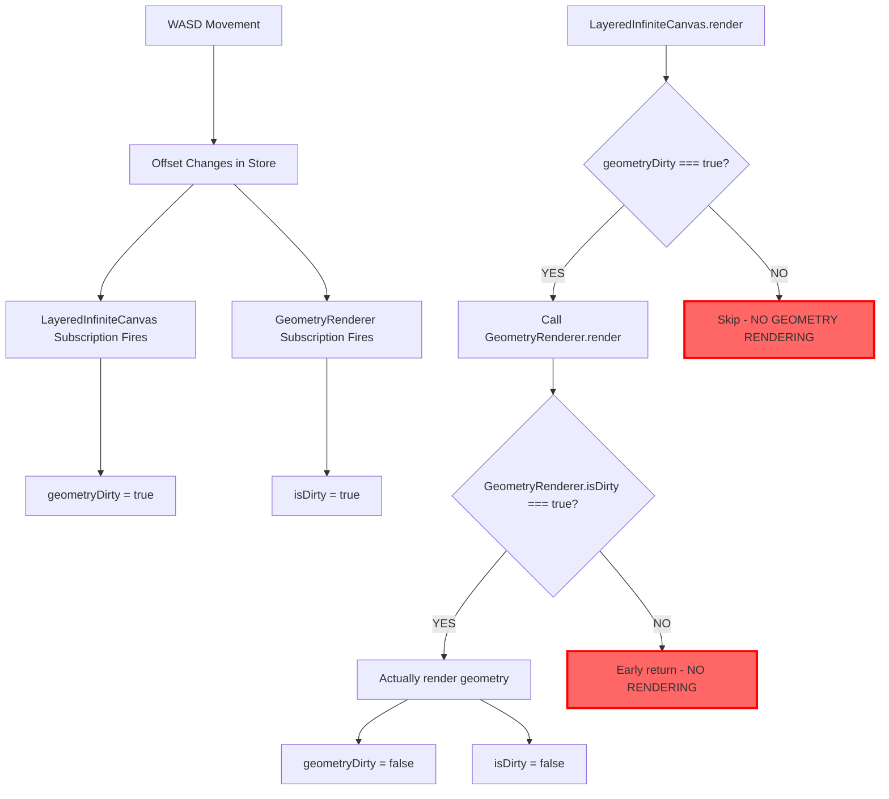

# 🔍 **LayeredInfiniteCanvas Subscription Architecture Study**

## 📊 **STUDY OBJECTIVES RESULTS**

### **1. Examine LayeredInfiniteCanvas subscription patterns** ✅

**Current Subscriptions in LayeredInfiniteCanvas.subscribeToStoreChanges() (Lines 346-382):**

```typescript
// ✅ Objects changes - triggers geometry rendering
subscribe(gameStore.geometry.objects, () => {
  this.geometryDirty = true
  this.markNewObjectsForTextureCapture()
})

// ✅ Active drawing changes - triggers preview rendering  
subscribe(gameStore.geometry.drawing.activeDrawing, () => {
  this.geometryDirty = true
})

// ✅ Layer visibility changes - triggers re-rendering
subscribe(gameStore.geometry.layerVisibility, () => {
  this.backgroundDirty = true
  this.geometryDirty = true
})

// ✅ Camera changes - triggers background re-rendering
subscribe(gameStore.camera, () => {
  if (gameStore.camera.pixeloid_scale !== this.lastPixeloidScale) {
    this.backgroundDirty = true
    this.lastPixeloidScale = gameStore.camera.pixeloid_scale
  }
})

// ✅ ALREADY EXISTS: Subscribe to offset changes for WASD movement rendering
subscribe(gameStore.mesh.vertex_to_pixeloid_offset, () => {
  this.geometryDirty = true
  console.log('🔄 LayeredInfiniteCanvas: Offset subscription triggered!', {
    newOffset: { ...gameStore.mesh.vertex_to_pixeloid_offset },
    geometryDirtyFlag: this.geometryDirty,
    timestamp: Date.now()
  })
})
```

### **2. Compare with GeometryRenderer subscriptions** ✅

**Current Subscriptions in GeometryRenderer (Lines 33-52):**

```typescript
// ✅ ALREADY EXISTS: React to coordinate system changes
subscribe(gameStore.mesh.vertex_to_pixeloid_offset, () => {
  this.isDirty = true
  console.log('🔄 GeometryRenderer: vertex_to_pixeloid_offset subscription triggered!', {
    newOffset: { ...gameStore.mesh.vertex_to_pixeloid_offset },
    isDirtyFlag: this.isDirty,
    timestamp: Date.now()
  })
})

// ✅ Camera changes subscription
subscribe(gameStore.camera, () => {
  this.isDirty = true
  console.log('GeometryRenderer: Camera changed, marking dirty')
})

// ✅ Drawing changes subscription for preview rendering
subscribe(gameStore.geometry.drawing.activeDrawing, () => {
  this.isDirty = true
  console.log('GeometryRenderer: Drawing changed, marking dirty for preview updates')
})
```

## 🚨 **CRITICAL DISCOVERY: Original Hypothesis Was INCORRECT**

### **❌ MISCONCEPTION: "Missing offset subscription"**
The original `geometry_flow_analysis.md` claimed LayeredInfiniteCanvas was missing the offset subscription, but **IT ALREADY EXISTS** (Line 374-382).

### **✅ ACTUAL PROBLEM: Double Dirty Tracking Coordination Issues**

Both components have the **SAME subscriptions** but use **DIFFERENT dirty flags**:

- **LayeredInfiniteCanvas**: `this.geometryDirty = true`
- **GeometryRenderer**: `this.isDirty = true`

## 🔄 **RENDERING FLOW ANALYSIS**

### **Current Flow (Race Condition Prone):**



### **Potential Race Conditions:**

1. **Timing Issue**: Subscriptions fire in different order
2. **Double Reset**: Flags get reset at wrong times
3. **Coordination Failure**: One flag true, other false

## 🎯 **ROOT CAUSE ANALYSIS**

### **Console Log Evidence Review:**
- **WASD movement** → Both subscriptions should fire
- **Mouse movement** → Both subscriptions should fire
- **If only one fires but not both** → Timing/coordination issue

### **The Real Problem:**
Not missing subscriptions, but **unnecessarily complex dual dirty tracking** with potential race conditions.

## ✅ **RECOMMENDED SOLUTION: Eliminate Dirty Tracking Complexity**

### **Strategy: "Always Render + Smart Memoization"**

```typescript
// REMOVE from GeometryRenderer:
private isDirty: boolean = true  // ❌ DELETE THIS
if (!this.isDirty) return        // ❌ DELETE THIS  
this.isDirty = false            // ❌ DELETE THIS

// ADD to GeometryRenderer:
private lastRenderHash: string = ""

public render(corners: ViewportCorners, pixeloidScale: number): void {
  // Smart memoization check
  const currentHash = this.calculateRenderHash(corners, pixeloidScale)
  if (currentHash === this.lastRenderHash) {
    console.log('⏭️ GeometryRenderer: Skipping render (memoized)')
    return
  }
  
  console.log('🖌️ GeometryRenderer: Rendering (inputs changed)')
  this.doActualRender(corners, pixeloidScale)
  this.lastRenderHash = currentHash
}
```

### **Memoization Hash Calculation:**
```typescript
private calculateRenderHash(corners: ViewportCorners, pixeloidScale: number): string {
  const offset = gameStore.mesh.vertex_to_pixeloid_offset
  const objects = gameStore.geometry.objects
  const activeDrawing = gameStore.geometry.drawing.activeDrawing
  
  return JSON.stringify({
    offset: { x: Math.round(offset.x * 1000), y: Math.round(offset.y * 1000) },
    scale: Math.round(pixeloidScale * 1000),
    objectsCount: objects.length,
    objectsHash: objects.map(o => `${o.id}-${o.createdAt}`).join(','),
    drawing: activeDrawing.isDrawing ? JSON.stringify(activeDrawing) : null,
    viewportHash: `${corners.topLeft.x}-${corners.topLeft.y}-${corners.bottomRight.x}-${corners.bottomRight.y}`
  })
}
```

## 📋 **IMPLEMENTATION PLAN**

### **Phase 1: Simplify GeometryRenderer (HIGH PRIORITY)**
1. **Remove `isDirty` property completely**
2. **Remove all `this.isDirty = true` assignments**
3. **Remove `if (!this.isDirty) return` early exit logic**
4. **Remove all isDirty-related subscriptions**

### **Phase 2: Add Smart Memoization**
1. **Add `lastRenderHash` tracking**
2. **Implement `calculateRenderHash()` method**
3. **Add memoization check at start of render()**
4. **Add performance logging for hits/misses**

### **Phase 3: Keep LayeredInfiniteCanvas Simple**
1. **Keep `geometryDirty` for major changes only (viewport, zoom)**
2. **Always call GeometryRenderer.render() - let memoization handle efficiency**
3. **Simplify subscription logic - no complex coordination needed**

### **Phase 4: Validation & Testing**
1. **Test WASD movement geometry rendering**
2. **Test mouse movement preview rendering**
3. **Monitor performance with memoization logging**
4. **Verify no redundant renders occur**

## 🔍 **ARCHITECTURAL BENEFITS**

### **Before (Complex):**
- Two dirty tracking systems
- Coordination required between flags
- Race condition potential
- Hard to debug when things go wrong

### **After (Simple):**
- One decision point in LayeredInfiniteCanvas
- GeometryRenderer uses memoization for efficiency
- No coordination needed
- Predictable and debuggable

## 📊 **PERFORMANCE EXPECTATIONS**

### **Memoization Hit Rate:**
- **WASD movement**: High hit rate during continuous movement
- **Mouse movement**: Medium hit rate depending on movement speed
- **Object changes**: Low hit rate (expected - objects actually changed)
- **Preview drawing**: Medium hit rate during smooth mouse movement

### **Overall Impact:**
- ✅ **Eliminates race conditions**
- ✅ **Maintains performance through memoization**
- ✅ **Simplifies debugging**
- ✅ **Reduces code complexity**

## 🎯 **CONCLUSION**

The **"missing offset subscription"** hypothesis was incorrect. Both components already have proper subscriptions. The real issue is **unnecessarily complex double dirty tracking** that creates coordination problems.

**Solution**: Eliminate the dual dirty system and replace with simple "always render + smart memoization" approach.

This will fix the WASD geometry rendering issue by removing the coordination complexity while maintaining performance through intelligent memoization.